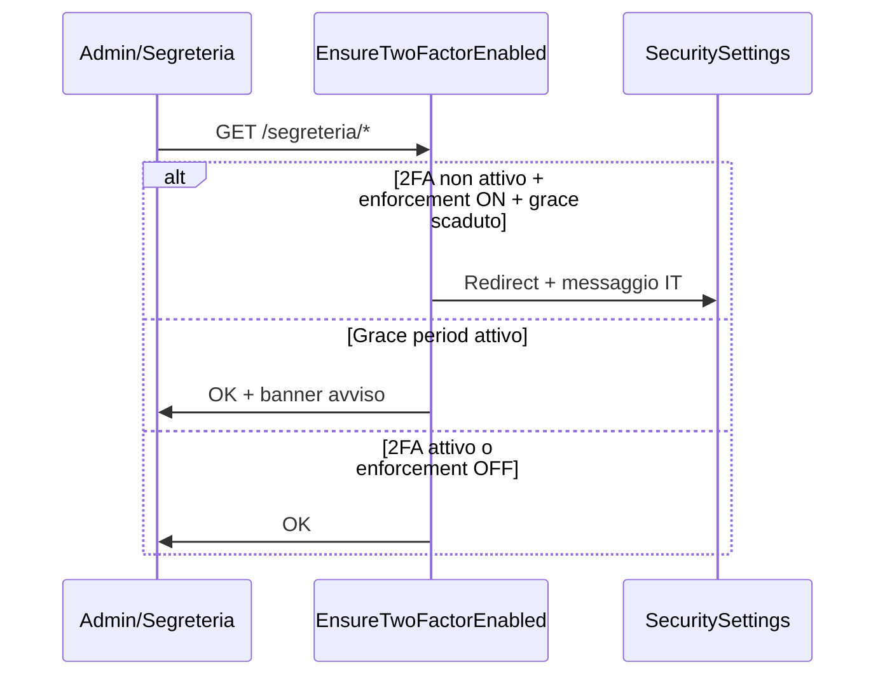

# Runbook prep 2FA — CRM RENTRI autodemolitore

**Stato:** opt-in (Sprint 67) + **enforcement configurabile admin/segreteria (Sprint 97)**.

---

## Obiettivo

Abilitare autenticazione a due fattori (TOTP) per ruoli con accesso a dati sensibili e funzioni RENTRI, senza bloccare operatività mobile operatore.

---

## Scope ruoli

| Ruolo | 2FA obbligatorio | Note |
|-------|------------------|------|
| admin | Sì (se `TWO_FACTOR_ENFORCE_ADMIN_SEGRETERIA=true`) | Horizon, audit, impostazioni |
| segreteria | Sì (se enforcement attivo) | RENTRI, MUD, VFU |
| editor | No | Back-office limitato — escluso da enforcement |
| operatore | No | Mobile bonifica — escluso da enforcement |

---

## Stack (Laravel)

1. **Package:** `pragmarx/google2fa` + `bacon/bacon-qr-code`
2. **Storage:** colonne `two_factor_secret`, `two_factor_confirmed_at` su `users` (encrypted)
3. **Enforcement:** middleware `EnsureTwoFactorEnabled` su route `segreteria.*` e `admin.*`
4. **Service:** `TwoFactorEnforcementService` — grace period + redirect IT

---

## Config enforcement (Sprint 97)

```env
# Default: enforcement disattivato (opt-in only)
TWO_FACTOR_ENFORCE_ADMIN_SEGRETERIA=false

# Periodo di grazia opzionale (ISO 8601) — banner senza blocco fino alla data
# TWO_FACTOR_ENFORCE_GRACE_UNTIL=2026-07-01T00:00:00+02:00
```

| Variabile | Default | Effetto |
|-----------|---------|---------|
| `TWO_FACTOR_ENFORCE_ADMIN_SEGRETERIA` | `false` | Se `true`, admin/segreteria senza 2FA → redirect `/segreteria/impostazioni/sicurezza` |
| `TWO_FACTOR_ENFORCE_GRACE_UNTIL` | — | Fino a questa data: banner avviso, accesso consentito |
| `TWO_FACTOR_OPTIONAL` | `true` | Opt-in UI (Sprint 67) |

---

## Fasi rollout

### Fase 0 — Prep ✅

- [x] Documentazione runbook
- [x] Inventario route sensibili

### Fase 1 — Opt-in ✅

- [x] Migrazione colonne 2FA
- [x] UI `SecuritySettingsPage`
- [x] Login challenge TOTP
- [x] Test Sprint 67

### Fase 2 — Enforced ✅ (Sprint 97)

- [x] Middleware `EnsureTwoFactorEnabled`
- [x] Grace period `TWO_FACTOR_ENFORCE_GRACE_UNTIL`
- [x] Banner dashboard + redirect IT
- [ ] Audit log eventi 2FA (futuro)
- [ ] Runbook reset 2FA admin-only (futuro)

### Fase 3 — Hardening

- [ ] IP allowlist admin
- [ ] WebAuthn / passkey
- [ ] Pen-test esterno

---

## Flusso enforcement



---

## Route consentite senza 2FA (enforcement attivo)

- `GET /segreteria/impostazioni/sicurezza`
- `POST /logout`

---

## Checklist sicurezza

- [x] Segreti TOTP cifrati at rest
- [x] Rate limit challenge 2FA (5/min)
- [x] CSRF su form setup/disabilita
- [x] Operatore escluso da enforcement
- [ ] Recovery codes (futuro)

---

## Comandi utili

```bash
php artisan test --filter=Sprint97
php artisan test --filter=Sprint67
```

---

## Riferimenti

- [SPRINT-97-AUDIT-NOTES.md](SPRINT-97-AUDIT-NOTES.md)
- [SPRINT-97-REVIEW-HANDOFF.md](SPRINT-97-REVIEW-HANDOFF.md)
- OWASP: `docs/OWASP-INTERNAL-CHECKLIST.md` (A07)
