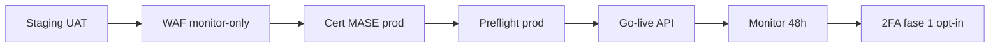

# GO-LIVE 360° — CRM RENTRI autodemolitore

**Ciclo 5 chiuso · Sprint 60** · Documento unico di sign-off interno pre-produzione.

Consolida: OWASP pen-test interno, prep WAF, prep 2FA, UAT UX, a11y e performance budget.

---

## 1. Esito ciclo 5 (sprint 51–60)

| Area | Deliverable ciclo 5 | Stato code/doc |
|------|---------------------|----------------|
| UX coerente | Design system, sidebar gruppi, empty states, form-field, onboarding tour | ✅ |
| Sicurezza operativa | Throttle login/FIR/RENTRI, Gate demo, policy Livewire, upload whitelist | ✅ |
| Accessibilità | Focus ring, aria-live flash, modali keyboard, high contrast, tablet | ✅ |
| Performance | Dashboard N+1 fix, audit indexes, k6 smoke stub, Lighthouse budget doc | ✅ prep |
| Moduli residui | VFU timeline, cert preview, MUD PDF, legacy report, tracking stub | ✅ |

**Suite test:** 398+ PHPUnit (giugno 2026). E2E palestra: `npm run test:e2e`.

---

## 2. Security sign-off interno

### 2.1 OWASP Top 10 — revisione interna

**Riferimento:** [OWASP-INTERNAL-CHECKLIST.md](OWASP-INTERNAL-CHECKLIST.md)

| Categoria | Controlli applicativi | Esito interno |
|-----------|----------------------|---------------|
| A01 Access control | Middleware ruoli, policy modelli, demo isolation test | ✅ implementato |
| A02 Crypto | Cert cifrati, APP_KEY, storage privato | ✅ implementato |
| A03 Injection | Eloquent + validazione Livewire | ✅ implementato |
| A04 Insecure design | Rate limit login/RENTRI/FIR | ✅ implementato |
| A05 Misconfiguration | preflight, Horizon gate, debug off prod | ✅ doc + preflight |
| A06 Components | composer/npm audit (periodico) | ☐ ops ricorrente |
| A07 Auth | CSRF, logout, bcrypt; **2FA non attivo** | ⚠️ vedi §2.3 |
| A08 Integrity | UploadValidation, $guarded modelli | ✅ implementato |
| A09 Logging | Activity log, indici audit, dashboard dead-letter | ✅ implementato |
| A10 SSRF | Endpoint RENTRI configurati | ✅ implementato |

**Verifica rapida:**

```bash
php artisan rentri:preflight
php artisan test --filter=UxSecurityQuickWinsTest
php artisan test --filter=DemoEcommerceMudIsolationTest
composer audit
```

**Pen-test OWASP esterno:** ☐ fuori scope ciclo 5 — pianificare pre-prod.

---

### 2.2 WAF — preparazione

**Riferimento:** [WAF-RULES-PREP.md](WAF-RULES-PREP.md)

| Item | Stato |
|------|-------|
| Regole documentate (login, Livewire, upload cert, admin, Horizon) | ✅ |
| Rollout staging monitor-only → block | ☐ infra DevOps |
| Log WAF → SIEM 90 gg | ☐ infra DevOps |
| Esclusioni Livewire/xFIR documentate | ✅ |

**Sign-off WAF applicativo:** prep completata — **attivazione WAF = gate infra go-live**.

---

### 2.3 2FA — preparazione

**Riferimento:** [2FA-PREP-RUNBOOK.md](2FA-PREP-RUNBOOK.md)

| Fase | Stato |
|------|-------|
| Fase 0 — documentazione runbook | ✅ |
| Fase 1 — opt-in TOTP (codice) | ☐ post go-live fase 2 |
| Fase 2 — enforced admin/segreteria | ☐ post go-live |
| Rate limit challenge / recovery codes | ☐ da implementare |

**Sign-off 2FA:** non bloccante per go-live MVP se VPN/IP allowlist staging; **obbligatorio entro 90 gg post-prod** per admin/segreteria.

---

## 3. Checklist go/no-go produzione

### 3.1 Applicazione

- [ ] `php artisan rentri:preflight` verde su staging
- [ ] `RENTRI_API_STUB=false` solo dopo cert MASE produzione validati
- [ ] `APP_DEBUG=false`, `APP_ENV=production`
- [ ] Horizon accessibile solo admin
- [ ] Session driver Redis su staging validato ([REDIS-SESSION-PREP.md](REDIS-SESSION-PREP.md))
- [ ] Cron `schedule:run` + `audit:export-scheduled` (stub → attivare storage)

### 3.2 UX & formazione

- [ ] UAT UX 360° completata ([UAT-UX-360-CHECKLIST.md](UAT-UX-360-CHECKLIST.md)) con firma
- [ ] Formazione palestra operativa ([UAT-FORMAZIONE-PALESTRA.md](UAT-FORMAZIONE-PALESTRA.md))
- [ ] Runbook post-deploy ([RUNBOOK-POST-DEPLOY.md](RUNBOOK-POST-DEPLOY.md))

### 3.3 Qualità

- [ ] PHPUnit suite completa verde (398+)
- [ ] Playwright E2E palestra verde
- [ ] A11y axe su pagine chiave ([A11Y-AUDIT-RUNBOOK.md](A11Y-AUDIT-RUNBOOK.md))
- [ ] Lighthouse budget rispettato ([LIGHTHOUSE-BUDGET.md](LIGHTHOUSE-BUDGET.md))

### 3.4 Dati & legacy

- [ ] `rentri:import-legacy --report` coerente con atteso
- [ ] Riconciliazione magazzino/registro manuale documentata
- [ ] Backup DB pre-go-live

---

## 4. Sequenza deploy consigliata



1. Deploy staging → UAT firmata.
2. WAF monitor-only 1 settimana.
3. Caricamento certificati MASE produzione.
4. `rentri:preflight` + smoke E2E produzione.
5. Switch `RENTRI_API_STUB=false` (orario concordato).
6. Monitoraggio dead-letter / Horizon 48h.
7. Roadmap 2FA + pen-test esterno.

---

## 5. Handoff team infra

| Asset | Owner | Doc |
|-------|-------|-----|
| TLS / DNS | DevOps | DEPLOY-PRODUCTION.md |
| WAF rules | DevOps | WAF-RULES-PREP.md |
| Redis session | DevOps | REDIS-SESSION-PREP.md |
| k6 load test | QA/DevOps | scripts/k6-smoke.js |
| Audit export S3 | DevOps | AUDIT-EXPORT-SCHEDULING-PREP.md |
| Cert MASE | Operatore RENTRI | GO-LIVE-RENTRI.md |

---

## 6. Sign-off ciclo 5

| Ruolo | Nome | Data | Firma |
|-------|------|------|-------|
| Product / operazioni | | | |
| Tech lead | | | |
| Security referente | | | |

**Esito ciclo 5:** ☐ GO-LIVE approvato · ☐ GO con riserve · ☐ Rinviato

**Riserve documentate:**

---

## Gap residui post-ciclo 5

1. **Pen-test OWASP esterno** — non eseguito in ciclo 5.
2. **2FA implementazione** — solo runbook; enforcement post go-live.
3. **WAF attivo** — solo documentazione; attivazione infra.
4. **Certificati MASE produzione** — team operatore + MASE.
5. **Deploy produzione infra** — secrets, CDN, backup automatizzati.
6. **UAT formazione firmata in sede** — runbook pronto, esecuzione operativa.
7. **Pagamenti e-commerce, immagini ricambi** — fuori scope MVP.
8. **Load test MASE reale** — k6 smoke locale only.

---

## Riferimenti incrociati

| Documento | Contenuto |
|-----------|-----------|
| [CICLO-5-PIANO-360.md](CICLO-5-PIANO-360.md) | Piano sprint 51–60 |
| [OWASP-INTERNAL-CHECKLIST.md](OWASP-INTERNAL-CHECKLIST.md) | A01–A10 dettaglio |
| [WAF-RULES-PREP.md](WAF-RULES-PREP.md) | Regole firewall |
| [2FA-PREP-RUNBOOK.md](2FA-PREP-RUNBOOK.md) | Rollout TOTP |
| [UAT-UX-360-CHECKLIST.md](UAT-UX-360-CHECKLIST.md) | Accettazione UX |
| [A11Y-AUDIT-RUNBOOK.md](A11Y-AUDIT-RUNBOOK.md) | Audit accessibilità |
| [LIGHTHOUSE-BUDGET.md](LIGHTHOUSE-BUDGET.md) | Budget performance |
