# GO-LIVE Certificazione Produzione — Ciclo 10 chiusura

**Ciclo 10 chiuso · Sprint 120** · Sign-off certificazione RENTRI produzione e hardening post go-live (sprint 111–119).

Consolida: validazione certificato RENTRI E2E ministeriale, automazione SLA/dead-letter, remediation pen-test vendor, WAF block tuning, PWA operatore, GPS/Stripe/HA live prep, KPI business v3 con alert.

**Baseline ereditata:** [GO-LIVE-PRODUZIONE.md](GO-LIVE-PRODUZIONE.md) (ciclo 9) · [GO-LIVE-RENTRI.md](GO-LIVE-RENTRI.md) · [VALIDAZIONE-CERT-PRODUZIONE-RENTRI.md](VALIDAZIONE-CERT-PRODUZIONE-RENTRI.md).

---

## 1. Esito ciclo 10 (sprint 111–120)

| Sprint | Focus | Deliverable chiave | Stato |
|--------|-------|-------------------|-------|
| **111** | RENTRI cert produzione E2E | `RentriProductionCertValidationService`, integration test gated | ✅ |
| **112** | SLA + dead-letter automation | `RentriSlaAlertService`, `rentri:sla-check --notify` | ✅ |
| **113** | Pen-test remediation vendor | `PenTestRemediationService`, `/admin/pen-test-prep` | ✅ |
| **114** | WAF block mode tuning | `WafDeploymentPreflightService` extended, findings cross-ref | ✅ |
| **115** | Operatore PWA + API mobile | `OperatoreMobileApiService`, manifest + service worker | ✅ |
| **116** | GPS provider produzione live | `TrasportoGpsProductionSwitchService`, probe + runbook | ✅ |
| **117** | Stripe reconciliation prod | `StripeProductionSwitchService`, CSV reconciliation | ✅ |
| **118** | HA failover drill | `HaFailoverDrillService`, `ha:failover-drill` | ✅ |
| **119** | KPI business v3 + alert | `BusinessKpiAlertService`, `kpi:business-check --notify` | ✅ |
| **120** | Chiusura GO-LIVE-CERT-PRODUZIONE | questo documento + smoke Sprint 120 | ✅ |

**Suite test:** 847 PHPUnit (giugno 2026, 6 skipped integration). Piano: [CICLO-10-PIANO.md](CICLO-10-PIANO.md).

---

## 2. Deliverable consolidati per area

### 2.1 RENTRI certificato produzione E2E (Sprint 111)

| Asset | Percorso |
|-------|----------|
| Validazione cert prod | `RentriProductionCertValidationService` |
| UI wizard | `RentriSettings` — sezione validazione certificato |
| Integration test gated | `RentriProductionIntegrationTest` (`RENTRI_PRODUCTION_INTEGRATION_TEST`) |
| Doc | [VALIDAZIONE-CERT-PRODUZIONE-RENTRI.md](VALIDAZIONE-CERT-PRODUZIONE-RENTRI.md) |

**Gate:** solo `api.rentri.gov.it` · cert mTLS + firma distinti · health + codifiche prod.

---

### 2.2 Post go-live monitoring SLA (Sprint 112)

| Asset | Percorso |
|-------|----------|
| Alert service | `RentriSlaAlertService` |
| CLI cron | `php artisan rentri:sla-check --notify --json` |
| Hub UI | `/segreteria/rentri` — ultimo check + breach history |
| Doc | [MONITORING-CICLO-3.md](MONITORING-CICLO-3.md) §4 |

**Env:** `RENTRI_SLA_P95_LATENCY_SECONDS` · `RENTRI_SLA_DEAD_LETTER_RATE_PERCENT`.

---

### 2.3 Pen-test remediation (Sprint 113)

| Asset | Percorso |
|-------|----------|
| Findings CRUD | `PenTestRemediationService` (JSON storage PT-XXX) |
| Admin UI | `/admin/pen-test-prep` |
| OWASP cross-ref | `OwaspExternalPrepService` — gate zero P0 |
| Doc | [REMEDIATION-FINDINGS-TEMPLATE.md](REMEDIATION-FINDINGS-TEMPLATE.md) |

---

### 2.4 WAF block tuning (Sprint 114)

| Asset | Percorso |
|-------|----------|
| Block checklist | `WafDeploymentPreflightService::productionBlockChecklist()` |
| Findings × WAF path | cross-ref `PenTestRemediationService` |
| Admin UI | `/admin/waf-status` — runbook tuning + toggle docs |
| Doc | [WAF-STAGING-ROLLOUT.md](WAF-STAGING-ROLLOUT.md) · [WAF-RULES-PREP.md](WAF-RULES-PREP.md) |

---

### 2.5 Operatore PWA (Sprint 115)

| Asset | Percorso |
|-------|----------|
| API JSON read-only | `OperatoreMobileApiService` · `/operatore/api/*` |
| PWA shell | `operatore-sw.js` · manifest · layout operatore |
| Doc | [OPERATORE-PWA.md](OPERATORE-PWA.md) |

---

### 2.6 GPS provider produzione (Sprint 116)

| Asset | Percorso |
|-------|----------|
| Switch service | `TrasportoGpsProductionSwitchService` |
| CLI | `php artisan trasporto:gps-switch-check --dry-run --probe` |
| UI | `/segreteria/trasporti` — checklist switch + preset field map |
| Doc | [GPS-PROVIDER-PRODUZIONE-RUNBOOK.md](GPS-PROVIDER-PRODUZIONE-RUNBOOK.md) |

**Env:** `TRASPORTO_GPS_STUB=false` · field map preset `flat_default` / `nested_fleet`.

---

### 2.7 Stripe reconciliation prod (Sprint 117)

| Asset | Percorso |
|-------|----------|
| Switch service | `StripeProductionSwitchService` |
| Reconciliation | `StripeReconciliationReportService` + export CSV |
| Dispute stub | `StripeDisputeStubService` |
| CLI | `php artisan stripe:production-switch-check --dry-run` |
| Doc | [STRIPE-RECONCILIATION-PRODUZIONE-RUNBOOK.md](STRIPE-RECONCILIATION-PRODUZIONE-RUNBOOK.md) |

---

### 2.8 HA failover drill (Sprint 118)

| Asset | Percorso |
|-------|----------|
| Drill service | `HaFailoverDrillService` |
| CLI | `php artisan ha:failover-drill --dry-run --probe` |
| Admin UI | `/admin/ha-status` — sezione esercitazione failover |
| Doc | [HA-FAILOVER-DRILL-RUNBOOK.md](HA-FAILOVER-DRILL-RUNBOOK.md) |

**Complemento:** [HA-BACKUP-DRILL-RUNBOOK.md](HA-BACKUP-DRILL-RUNBOOK.md) (Sprint 108).

---

### 2.9 KPI business v3 (Sprint 119)

| Asset | Percorso |
|-------|----------|
| Export CSV | `BusinessKpiExportService` |
| Alert email | `BusinessKpiAlertService` · `BusinessKpiBreachMail` |
| CLI cron | `php artisan kpi:business-check --notify` (daily 07:30) |
| UI | `/segreteria` KPI v3 · `/admin/audit` banner alert |
| Doc | [KPI-BUSINESS-DASHBOARD-V3.md](KPI-BUSINESS-DASHBOARD-V3.md) |

---

## 3. Smoke commands (certificazione produzione E2E)

### 3.1 Chiusura ciclo 10

```bash
cd new-rentri-crm
php -d memory_limit=512M vendor/bin/phpunit              # suite 847+ (6 skipped)
php artisan test --filter=Sprint120                       # doc + smoke chiusura ciclo 10
php artisan test --filter=Sprint111                       # RENTRI cert prod validation
php artisan test --filter=Sprint112                       # SLA alert automation
php artisan test --filter=Sprint116                       # GPS production switch
php artisan test --filter=Sprint117                       # Stripe reconciliation
php artisan test --filter=Sprint118                       # HA failover drill
php artisan test --filter=Sprint119                       # KPI business v3
```

### 3.2 Preflight CLI ciclo 10

```bash
php artisan rentri:production-switch-check --dry-run     # checklist switch MASE (ciclo 9)
php artisan rentri:sla-check --notify --json              # SLA P95 + dead-letter
php artisan trasporto:gps-switch-check --dry-run            # GPS live readiness
php artisan stripe:production-switch-check --dry-run      # Stripe prod readiness
php artisan ha:failover-drill --dry-run                   # HA drill readiness
php artisan kpi:business-check --notify --json            # KPI business soglie
php artisan rentri:preflight                              # deploy preflight
php artisan rentri:monitor                                # health + dead-letter snapshot
```

### 3.3 UI smoke (browser)

- `/segreteria/impostazioni/rentri` — validazione certificato produzione (Sprint 111)
- `/segreteria/rentri` — SLA check + breach history (Sprint 112)
- `/admin/pen-test-prep` — findings remediation (Sprint 113)
- `/admin/waf-status` — block checklist + tuning (Sprint 114)
- `/operatore` — PWA installabile (Sprint 115)
- `/segreteria/trasporti` — GPS switch checklist (Sprint 116)
- `/segreteria/ecommerce` — Stripe reconciliation + export (Sprint 117)
- `/admin/ha-status` — failover drill (Sprint 118)
- `/segreteria` — KPI business v3 + export CSV (Sprint 119)

### 3.4 Regression cicli 9–10

```bash
php artisan test --filter=Sprint110                       # chiusura ciclo 9
php artisan test --filter=Cycle9ClosureGoLiveTest
php artisan test --filter=RentriProductionSwitchTest      # switch MASE (106)
```

---

## 4. Checklist certificazione produzione E2E

### 4.1 P0 — RENTRI certificato ministeriale

- [ ] `RentriProductionCertValidationService` — checklist verde su staging pre-prod
- [ ] Cert mTLS + firma xFIR produzione validi e distinti da sandbox
- [ ] Health + codifiche CER su `api.rentri.gov.it` (no demoapi)
- [ ] `RENTRI_PRODUCTION_INTEGRATION_TEST=1` eseguito almeno una volta fuori CI default
- [ ] `rentri:production-switch-check` SUCCESS prima del go-live definitivo
- [ ] Runbook [VALIDAZIONE-CERT-PRODUZIONE-RENTRI.md](VALIDAZIONE-CERT-PRODUZIONE-RENTRI.md) firmato ops

### 4.2 P1 — Monitoring e security post go-live

- [ ] `rentri:sla-check --notify` in cron hourly — zero breach P95/dead-letter sostenuto
- [ ] Pen-test findings P0 chiusi o con remediation plan ([PenTestRemediationService](app/Domain/Security/PenTestRemediationService.php))
- [ ] WAF `block` mode attivo con tuning post-deploy ([WAF-STAGING-ROLLOUT.md](WAF-STAGING-ROLLOUT.md))
- [ ] Audit log + export operativi

### 4.3 P2 — Verticali live e infra

- [ ] GPS — `trasporto:gps-switch-check` SUCCESS · contratto fornitore firmato
- [ ] Stripe — `stripe:production-switch-check` SUCCESS · reconciliation matched
- [ ] HA — failover drill staging documentato · `HA_LAST_FAILOVER_DRILL_AT` aggiornato
- [ ] Operatore PWA — smoke login + API read-only
- [ ] KPI v3 — soglie `KPI_BUSINESS_*` allineate ops · `kpi:business-check` verde

### 4.4 P3 — Qualità

- [ ] PHPUnit 847+ verde · [GO-LIVE-PRODUZIONE.md](GO-LIVE-PRODUZIONE.md) checklist ancora valida
- [ ] Playwright smoke (opzionale)
- [ ] k6 smoke sotto soglia (opzionale)

---

## 5. Sequenza certificazione consigliata

```mermaid
flowchart LR
    A[Smoke Sprint 120] --> B[Cert validation UI]
    B --> C[sla-check + monitor 48h]
    C --> D[Pen-test P0 chiusi]
    D --> E[WAF block tuning]
    E --> F[GPS + Stripe switch check]
    F --> G[HA failover drill staging]
    G --> H[RENTRI switch produzione]
    H --> I[KPI v3 + sign-off]
```



1. Smoke §3.1–3.2 su staging con env sandbox completo.
2. Validazione certificato produzione (Sprint 111) — UI step + integration test gated.
3. Monitoraggio 48h post-switch: `rentri:sla-check`, dead-letter, KPI v3.
4. Verticali live: GPS probe → Stripe reconciliation → HA drill documentato.
5. Sign-off §7 con riserve documentate.

---

## 6. Handoff team

| Asset | Owner | Doc / UI / CLI |
|-------|-------|----------------|
| Cert RENTRI produzione | Ops RENTRI | [VALIDAZIONE-CERT-PRODUZIONE-RENTRI.md](VALIDAZIONE-CERT-PRODUZIONE-RENTRI.md) |
| SLA automation | Ops RENTRI | `rentri:sla-check` · hub RENTRI |
| Pen-test remediation | Security | `/admin/pen-test-prep` |
| WAF block tuning | DevOps | `/admin/waf-status` |
| GPS provider live | Trasporti | `trasporto:gps-switch-check` |
| Stripe reconciliation | Business/DevOps | `stripe:production-switch-check` |
| HA failover | DevOps | `ha:failover-drill` · `/admin/ha-status` |
| KPI business alert | Product/Ops | `kpi:business-check` · dashboard v3 |
| Operatore PWA | Product | [OPERATORE-PWA.md](OPERATORE-PWA.md) |

---

## 7. Sign-off ciclo 10

| Ruolo | Nome | Data | Firma |
|-------|------|------|-------|
| Product / operazioni | | | |
| Tech lead | | | |
| Security referente | | | |
| DevOps / infra | | | |
| Referente RENTRI / MASE | | | |

**Esito ciclo 10:** ☐ Certificazione produzione approvata · ☐ GO con riserve · ☐ Rinviato

**Riserve documentate:**

---

## 8. Gap residui post-ciclo 10 (infra / vendor / esterno)

Prep **completata in code e documentazione** — attivazione richiede azioni team esterno:

| # | Gap | Stato code | Azione residua |
|---|-----|------------|----------------|
| 1 | **RENTRI cert prod smoke ministeriale** | Validation service + gated test ✅ | Esecuzione manuale con cert operatore reale su api.rentri.gov.it |
| 2 | **RENTRI switch MASE definitivo** | Checklist ciclo 9+10 ✅ | Change window produzione + monitor 48h post-switch |
| 3 | **Pen-test vendor engagement** | Remediation workflow ✅ | Audit esterno completato + chiusura findings P0/P1 |
| 4 | **WAF block produzione CDN** | Preflight + tuning runbook ✅ | Deploy regole su AWS/CloudFront o equivalente |
| 5 | **GPS contratto fornitore** | Switch + probe + field map ✅ | Firma SLA vendor + URL/API key produzione |
| 6 | **Stripe account business live** | Switch + reconciliation ✅ | Onboarding account + webhook prod verificato |
| 7 | **HA failover esercitazione reale** | Drill service + runbook ✅ | Drill staging con LB reale + sign-off DevOps |
| 8 | **Backup restore drill** | Runbook trimestrale (108) ✅ | Esecuzione drill e aggiornamento `DB_BACKUP_LAST_DRILL_AT` |
| 9 | **SMTP/notifiche live volume** | Preflight ciclo 9 ✅ | Cap SMTP provider + `NOTIFICATIONS_LIVE=true` |
| 10 | **App operatore nativa** | PWA + API prep ✅ | Store iOS/Android — fuori scope CRM |
| 11 | **Dispute Stripe live** | Stub workflow ✅ | `STRIPE_DISPUTE_STUB=false` + evidence workflow |
| 12 | **Integration test CI prod** | Gated env only ✅ | Runner dedicato con cert prod (mai CI default) |

---

## Riferimenti incrociati

| Documento | Contenuto |
|-----------|-----------|
| [GO-LIVE-PRODUZIONE.md](GO-LIVE-PRODUZIONE.md) | Sign-off ciclo 9 (baseline infra) |
| [CICLO-10-PIANO.md](CICLO-10-PIANO.md) | Piano sprint 111–120 (CHIUSO) |
| [CICLO-9-PIANO.md](CICLO-9-PIANO.md) | Piano sprint 101–110 (CHIUSO) |
| [RENTRI_VERTICAL_BACKLOG.md](RENTRI_VERTICAL_BACKLOG.md) §13 | Backlog ciclo 10 (CHIUSO) |
| [SPRINT-120-REVIEW-HANDOFF.md](SPRINT-120-REVIEW-HANDOFF.md) | Handoff finale ciclo 10 |
