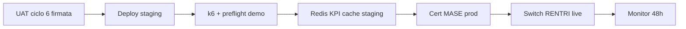

# GO-LIVE Ciclo 6 — Completamento verticale moduli CRM RENTRI

**Ciclo 6 chiuso · Sprint 75** · Documento di sign-off moduli verticali (sprint 61–74).

Consolida: e-commerce, anagrafiche, VFU, magazzino, MUD, notifiche, 2FA slice, analytics, RENTRI prod, trasporti/FIR, bonifica operatore, legacy sync, audit export live, performance KPI cache.

**Baseline:** [GO-LIVE-360.md](GO-LIVE-360.md) (ciclo 5) resta valido per UX, sicurezza e a11y.

---

## 1. Esito ciclo 6 (sprint 61–74)

| Sprint | Modulo | Deliverable | Stato code/doc |
|--------|--------|-------------|----------------|
| **61** | E-commerce | Immagini, checkout token, stati ordine | ✅ |
| **62** | Anagrafiche | P.IVA/CF, alert autorizzazioni | ✅ |
| **63** | VFU | Allegati, export CSV storico | ✅ |
| **64** | Magazzino | Export registro CSV, alert serbatoio | ✅ |
| **65** | MUD | Validazione XML, invio stub ministeriale | ✅ |
| **66** | Notifiche | NotificationService, template, coda | ✅ |
| **67** | 2FA | TOTP opt-in, challenge login | ✅ |
| **68** | Analytics | Dashboard periodo, export KPI CSV | ✅ |
| **69** | RENTRI prod | Readiness checklist, switch live guidato | ✅ |
| **70** | Trasporti/FIR | Bulk export, tracking prep | ✅ |
| **71** | Bonifica operatore | Foto→catalogo, checklist pericolosi | ✅ |
| **72** | Legacy import | Sync incrementale, diff report | ✅ |
| **73** | Audit export | Storage live, download admin, job scheduled | ✅ |
| **74** | Performance | KPI Redis cache, k6 autenticato, monitoring | ✅ |

**Suite test:** 508+ PHPUnit (giugno 2026). UAT moduli: [UAT-CICLO-6-CHECKLIST.md](UAT-CICLO-6-CHECKLIST.md).

---

## 2. Smoke commands (pre/post deploy)

### 2.1 Applicazione

```bash
cd new-rentri-crm
php artisan test                              # suite completa 508+
php artisan test --filter=Sprint75            # chiusura ciclo 6
php artisan rentri:preflight                  # check pre-deploy produzione
php artisan rentri:preflight --demo           # check demo/staging
php artisan rentri:monitor                    # health + dead-letter KPI
php artisan legacy:sync-incremental --dry-run # smoke legacy sync
php artisan audit:export-scheduled --dry-run  # smoke audit export (se supportato)
npm run build                                 # asset production
```

### 2.2 Load test (opzionale staging)

```bash
# Smoke anonimo (ciclo 5)
k6 run scripts/k6-smoke.js

# Scenari autenticati segreteria/operatore (ciclo 6)
K6_BASE_URL=http://127.0.0.1:8000 k6 run scripts/k6-authenticated.js
```

### 2.3 E2E palestra (regressione ciclo 4–5)

```bash
npm run test:e2e
```

---

## 3. Checklist go/no-go moduli ciclo 6

### 3.1 Moduli verticali

- [ ] UAT ciclo 6 completata ([UAT-CICLO-6-CHECKLIST.md](UAT-CICLO-6-CHECKLIST.md)) con firma
- [ ] E-commerce checkout stub — flusso bozza→confermato verificato
- [ ] MUD invio stub — protocollo e activity log coerenti
- [ ] RENTRI prod readiness — checklist 6 voci prima switch live
- [ ] Legacy sync incrementale — diff report dashboard aggiornato
- [ ] Audit export — download admin + checksum verificati
- [ ] KPI cache Redis — TTL e refresh manuali su staging (fallback array in dev)

### 3.2 Monitoring & performance

- [ ] [PERFORMANCE-MONITORING.md](PERFORMANCE-MONITORING.md) letto da ops
- [ ] Horizon accessibile solo admin
- [ ] k6 autenticato eseguito almeno una volta su staging
- [ ] [MONITORING-CICLO-3.md](MONITORING-CICLO-3.md) — dead-letter/retry monitorati 48h post-deploy

### 3.3 Qualità (eredita ciclo 5)

- [ ] PHPUnit 508+ verde
- [ ] Playwright E2E palestra verde
- [ ] A11y axe su pagine chiave ([A11Y-AUDIT-RUNBOOK.md](A11Y-AUDIT-RUNBOOK.md))
- [ ] GO-LIVE-360 security sign-off ancora valido

---

## 4. Sequenza deploy consigliata (post ciclo 6)



1. UAT moduli 61–74 firmata in sede.
2. Deploy staging → smoke commands §2.1.
3. Validare KPI cache Redis + invalidazione event-driven.
4. k6 autenticato su staging (segreteria + operatore).
5. Certificati MASE produzione + `rentri:preflight` prod.
6. Switch live RENTRI (orario concordato) — vedi [GO-LIVE-RENTRI.md](GO-LIVE-RENTRI.md).
7. Monitoraggio Horizon/dead-letter 48h.

---

## 5. Handoff team infra

| Asset | Owner | Doc |
|-------|-------|-----|
| Redis KPI cache | DevOps | [PERFORMANCE-MONITORING.md](PERFORMANCE-MONITORING.md) |
| Audit export S3/local | DevOps | `config/audit.php`, disk `audit_exports` |
| Legacy sync schedule | DevOps | `routes/console.php` — `legacy:sync-incremental` |
| k6 load authenticated | QA/DevOps | `scripts/k6-authenticated.js` |
| Gateway pagamento | Product/infra | Gap post-ciclo 6 §6 |
| MUD telematico live | Operatore/MASE | Gap post-ciclo 6 §6 |

---

## 6. Sign-off ciclo 6

| Ruolo | Nome | Data | Firma |
|-------|------|------|-------|
| Product / operazioni | | | |
| Tech lead | | | |
| Security referente | | | |

**Esito ciclo 6:** ☐ Moduli approvati · ☐ GO con riserve · ☐ Rinviato

**Riserve documentate:**

---

## Gap residui post-ciclo 6 (tutti i moduli)

Priorità **infra / normativa** — fuori scope implementazione ciclo 6:

1. **Gateway pagamento e-commerce reale** (Stripe/Nexi) — checkout attualmente stub token.
2. **MUD invio telematico ministeriale live** — solo stub protocollo `MUD-STUB-*`.
3. **2FA enforced admin/segreteria** — opt-in implementato; enforcement post go-live ([2FA-PREP-RUNBOOK.md](2FA-PREP-RUNBOOK.md)).
4. **WAF + pen-test OWASP esterno** — prep ciclo 5; attivazione infra ([WAF-RULES-PREP.md](WAF-RULES-PREP.md)).
5. **Deploy produzione infra** — secrets, CDN, backup automatizzati, Redis session prod.
6. **Certificati MASE produzione 100%** — team operatore + MASE ([GO-LIVE-RENTRI.md](GO-LIVE-RENTRI.md)).
7. **Tracking GPS trasporti reale** — stub timeline/ETA (Sprint 70 prep).
8. **SMTP live + push operatore** — notifiche su log/coda stub ([NotificationService](app/Domain/Notifications/NotificationService.php)).
9. **Email agenzia VFU / push bonifica** — stub o log driver.
10. **Load test MASE reale** — k6 locale/staging only; no traffic ministeriale in CI.

---

## Riferimenti incrociati

| Documento | Contenuto |
|-----------|-----------|
| [CICLO-6-PIANO-MODULI-COMPLETI.md](CICLO-6-PIANO-MODULI-COMPLETI.md) | Piano sprint 61–75 (CHIUSO) |
| [UAT-CICLO-6-CHECKLIST.md](UAT-CICLO-6-CHECKLIST.md) | Accettazione moduli 61–74 |
| [GO-LIVE-360.md](GO-LIVE-360.md) | Baseline ciclo 5 |
| [PERFORMANCE-MONITORING.md](PERFORMANCE-MONITORING.md) | KPI cache, k6, Horizon prep |
| [RENTRI_VERTICAL_BACKLOG.md](RENTRI_VERTICAL_BACKLOG.md) | Handoff e gap post-ciclo |
