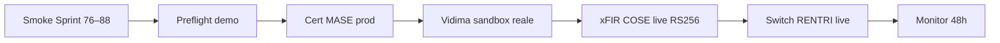

# GO-LIVE Enterprise — Ciclo 7 RENTRI/FIR ministeriale

**Ciclo 7 chiuso · Sprint 90** · Sign-off remediation enterprise P0–P2 (sprint 76–88).

Consolida: runtime mode stub/live, stub offline senza cert, COSE alg RS256/ES256, vidima validator, poll xFIR dedicato, contract payload MASE, badge UI stub/live, mapper COSE `payload_firmato`.

**Baseline:** [GO-LIVE-CICLO-6.md](GO-LIVE-CICLO-6.md) (moduli verticali) e [GO-LIVE-360.md](GO-LIVE-360.md) (UX/sicurezza) restano validi. **Successore operativo (Ciclo 8):** [GO-LIVE-OPERATIVO.md](GO-LIVE-OPERATIVO.md) — validazione operativa reale, CHIUSO.

---

## 1. Esito ciclo 7 (sprint 76–88)

| Priorità | Item | Sprint | Deliverable | Stato |
|----------|------|--------|-------------|-------|
| **P0-1** | COSE alg RS256/ES256 per tipo chiave | 76 | `RentriXfirCoseSigner` | ✅ |
| **P0-2** | Runtime mode stub/live da DB | 76 | `RentriRuntimeModeService` su QR, registro, UI | ✅ |
| **P0-3** | Stub offline senza cert mTLS | 76 | `signRequestForMode`, `offlineStubHeaders` | ✅ |
| **P1-1** | Sync blocchi aggiorna progressivi | 78 | `RentriFirBlocchiSync` update esistenti | ✅ |
| **P1-2** | Preflight riflette runtime live | 78 | `PreflightService` / `DemoPreflightService` | ✅ |
| **P1-3** | Vidima validator service-layer | 80 | `RentriFirVidimaValidator` + UI checklist | ✅ |
| **P1-4** | Poll xFIR timeout config dedicato | 82 | `RENTRI_XFIR_POLL_*` separato da FIR | ✅ |
| **P1-5** | Contract payload MASE | 84 | Fixture + `RentriMasePayloadContractTest` | ✅ |
| **P2-1** | UI copy stub/live badge | 86 | `x-rentri-api-mode-badge` su hub RENTRI/FIR | ✅ |
| **—** | COSE `payload_firmato` strip CRM | 88 | `RentriXfirCoseTransmissionMapper` | ✅ |

**Suite test:** 569+ PHPUnit (giugno 2026). Audit: [CICLO-7-ENTERPRISE-AUDIT.md](CICLO-7-ENTERPRISE-AUDIT.md).

---

## 2. Smoke commands (pre/post deploy)

### 2.1 Remediation enterprise (ciclo 7)

```bash
cd new-rentri-crm
php artisan test                              # suite completa 569+
php artisan test --filter=Sprint90            # chiusura ciclo 7 (doc + smoke)
php artisan test --filter=Sprint76            # P0 runtime/stub/COSE alg
php artisan test --filter=Sprint80            # P1-3 vidima validator
php artisan test --filter=Sprint82            # P1-4 poll xFIR config
php artisan test --filter=Sprint84            # P1-5 contract MASE
php artisan test --filter=Sprint86            # P2-1 UI badge stub/live
php artisan test --filter=Sprint88            # COSE payload_firmato mapper
php artisan rentri:preflight                  # check pre-deploy produzione
php artisan rentri:preflight --demo           # check demo/staging
php artisan rentri:monitor                    # health + dead-letter KPI
```

### 2.2 Regression xFIR / RENTRI (cicli 2–3)

```bash
php artisan test --filter=Sprint34            # firma COSE xFIR
php artisan test --filter=Sprint39            # invio xFIR firmato MASE
php artisan test --filter=Sprint42            # edge vidima / QR payload
```

### 2.3 E2E palestra + load (cicli 4–6)

```bash
npm run test:e2e                              # Playwright palestra
k6 run scripts/k6-smoke.js                    # smoke anonimo
K6_BASE_URL=http://127.0.0.1:8000 k6 run scripts/k6-authenticated.js
```

---

## 3. Checklist go/no-go enterprise RENTRI/FIR

### 3.1 P0 — Runtime e stub

- [ ] `RentriRuntimeModeService` — badge stub/live coerente su TrasportoShow, registro, QR post-vidima
- [ ] Palestra offline (`RENTRI_DEMO_NO_HTTP=true`) — health/vidima senza PKCS#12 mTLS
- [ ] Firma xFIR live — COSE alg `RS256` (RSA) o `ES256` (EC) per tipo chiave certificato firma
- [ ] Switch live UI → preflight verde prima submit vidima/registro/xFIR

### 3.2 P1 — Gate operativi e contract MASE

- [ ] Vidima bloccata se CF operatore, sito, cert mTLS (live), onboarding incompleto — checklist UI OK/KO
- [ ] Sync blocchi FIR aggiorna `progressivo_ultimo` su blocchi già importati
- [ ] Poll xFIR usa `RENTRI_XFIR_POLL_INTERVAL_MS` / `RENTRI_XFIR_POLL_TIMEOUT_MS` (non timeout vidima)
- [ ] Contract fixture MASE vidima/xFIR/registro — enum CARICO/SCARICO, tipi payload
- [ ] Trasmissione xFIR — `payload_firmato` contiene solo 5 chiavi COSE (no `api_mode`, `numero_fir`, `firmato_at`, `stub`)

### 3.3 P2 — Osservabilità UI

- [ ] Badge `x-rentri-api-mode-badge` visibile su TrasportoShow, hub RENTRI, FIR index, impostazioni, tracking
- [ ] Label IT: «Stub sandbox» / «RENTRI live» / «Demo offline»

### 3.4 Qualità (eredita cicli 5–6)

- [ ] PHPUnit 569+ verde
- [ ] Playwright E2E palestra verde
- [ ] GO-LIVE-360 security sign-off ancora valido
- [ ] GO-LIVE-CICLO-6 moduli verticali ancora validi

---

## 4. Sequenza deploy consigliata (post ciclo 7)



1. Smoke commands §2.1 su staging.
2. Validare vidima validator con cert operatore sandbox.
3. Firma xFIR + trasmissione — verificare `payload_firmato` COSE-only in log/storico API.
4. Certificati MASE produzione + `rentri:preflight` prod.
5. Switch live RENTRI (orario concordato) — vedi [GO-LIVE-RENTRI.md](GO-LIVE-RENTRI.md).
6. Monitoraggio Horizon/dead-letter 48h.

---

## 5. Handoff team infra

| Asset | Owner | Doc |
|-------|-------|-----|
| Cert mTLS + firma xFIR | Operatore RENTRI | [GO-LIVE-RENTRI.md](GO-LIVE-RENTRI.md) |
| Poll xFIR env | DevOps | `.env.example` — `RENTRI_XFIR_POLL_*` |
| Contract fixture MASE | QA | `tests/fixtures/rentri/mase/` |
| Sandbox integration CI | DevOps | Gap post-ciclo 7 §6 |
| SLA monitoring RENTRI | Ops | Gap post-ciclo 7 §6 |

---

## 6. Sign-off ciclo 7

| Ruolo | Nome | Data | Firma |
|-------|------|------|-------|
| Product / operazioni | | | |
| Tech lead | | | |
| Security referente | | | |

**Esito ciclo 7:** ☐ Enterprise RENTRI approvato · ☐ GO con riserve · ☐ Rinviato

**Riserve documentate:**

---

## Gap residui post-ciclo 7 (enterprise)

Priorità **operativa / infra** — **risolti in ciclo 8** (sprint 91–99). Vedi [GO-LIVE-OPERATIVO.md](GO-LIVE-OPERATIVO.md) per checklist deploy unificata e gap residui post-ciclo 8.

Storico gap ciclo 7 (chiusi):

1. ~~**Validazione live cert sandbox**~~ → Sprint 91 `RentriSandboxValidationService` + wizard UI.
2. ~~**Integration test sandbox CI**~~ → Sprint 92 workflow gated.
3. ~~**Metriche SLA RENTRI**~~ → Sprint 93 `RentriSlaMetricsService`.
4. ~~**Payload vidima OpenAPI**~~ → Sprint 94 `RentriFirVidimaTransmissionMapper`.
5. **Eredità cicli 5–6** — parzialmente risolte in ciclo 8 (2FA enforced, MUD/Stripe/GPS/SMTP live prep). Residui: WAF attivo, pen-test esterno, deploy infra. Vedi [GO-LIVE-OPERATIVO.md](GO-LIVE-OPERATIVO.md) §8.

---

## Riferimenti incrociati

| Documento | Contenuto |
|-----------|-----------|
| [CICLO-7-PIANO.md](CICLO-7-PIANO.md) | Piano sprint 76–90 (CHIUSO) |
| [CICLO-7-ENTERPRISE-AUDIT.md](CICLO-7-ENTERPRISE-AUDIT.md) | Audit conformità RENTRI/FIR |
| [SPRINT-88-AUDIT-NOTES.md](SPRINT-88-AUDIT-NOTES.md) | Audit COSE payload_firmato |
| [GO-LIVE-RENTRI.md](GO-LIVE-RENTRI.md) | Go-live API RENTRI operativo |
| [GO-LIVE-CICLO-6.md](GO-LIVE-CICLO-6.md) | Moduli verticali CRM |
| [GO-LIVE-360.md](GO-LIVE-360.md) | Security sign-off ciclo 5 |
| [GO-LIVE-OPERATIVO.md](GO-LIVE-OPERATIVO.md) | Go-live ciclo 8: validazione operativa reale |
| [CICLO-8-PIANO.md](CICLO-8-PIANO.md) | Piano sprint 91–100 (CHIUSO) |
