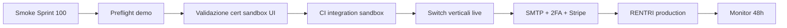

# GO-LIVE Operativo — Ciclo 8 validazione reale

**Ciclo 8 chiuso · Sprint 100** · Sign-off operativo post-enterprise (sprint 91–99).

Consolida: validazione sandbox MASE, CI integration gated, SLA RENTRI, payload vidima OpenAPI, MUD telematico live prep, Stripe e-commerce, 2FA enforced, GPS trasporti, SMTP notifiche live.

**Baseline ereditata:** [GO-LIVE-ENTERPRISE.md](GO-LIVE-ENTERPRISE.md) (ciclo 7) · [GO-LIVE-360.md](GO-LIVE-360.md) (UX/sicurezza) · [GO-LIVE-CICLO-6.md](GO-LIVE-CICLO-6.md) (moduli verticali).

---

## 1. Esito ciclo 8 (sprint 91–100)

| Sprint | Focus | Deliverable chiave | Stato |
|--------|-------|-------------------|-------|
| **91** | Validazione cert sandbox | `RentriSandboxValidationService`, wizard UI | ✅ |
| **92** | CI integration sandbox | `.github/workflows/rentri-sandbox-integration.yml` | ✅ |
| **93** | SLA dashboard RENTRI | `RentriSlaMetricsService`, KPI hub | ✅ |
| **94** | Vidima OpenAPI | `RentriFirVidimaTransmissionMapper` MASE-only | ✅ |
| **95** | MUD telematico live prep | `MudTelematicoTransmissionService`, badge UI | ✅ |
| **96** | Stripe e-commerce | `EcommercePaymentGatewayService`, webhook | ✅ |
| **97** | 2FA enforced | `EnsureTwoFactorEnabled`, grace period | ✅ |
| **98** | GPS trasporti | `TrasportoGpsTrackingService`, mappa OSM | ✅ |
| **99** | SMTP notifiche | `MailTransportRuntimeService`, test email UI | ✅ |
| **100** | Chiusura docs | questo documento + smoke Sprint 100 | ✅ |

**Suite test:** 649 PHPUnit (giugno 2026, 4 skipped integration sandbox). Piano: [CICLO-8-PIANO.md](CICLO-8-PIANO.md).

---

## 2. Checklist env unificata — demo vs produzione

### 2.1 Legenda modalità

| Profilo | `APP_ENV` | Stub default | Uso |
|---------|-----------|--------------|-----|
| **Demo / palestra** | `demo` | tutti stub `true` | Formazione, walkthrough, no HTTP ministeriale |
| **Staging sandbox** | `staging` | RENTRI sandbox + stub verticali | Validazione cert operatore, test invio |
| **Produzione** | `production` | stub `false` dove indicato | Go-live operativo |

Eseguire sempre `php artisan rentri:preflight` (prod) o `php artisan rentri:preflight --demo` (demo) prima del deploy.

---

### 2.2 RENTRI — sandbox e produzione

| Variabile | Demo / stub | Staging sandbox | Produzione |
|-----------|-------------|-----------------|------------|
| `RENTRI_ENV` | `sandbox` | `sandbox` | `production` |
| `RENTRI_API_STUB` | `true` | `false` | `false` |
| `RENTRI_FIRMA_STUB` | `true` | `false` (test firma reale) | `false` |
| `RENTRI_AUTH_MODE` | `mtls` | `mtls` | `mtls` |
| `RENTRI_BASE_URL_SANDBOX` | demoapi | demoapi | — |
| `RENTRI_BASE_URL_PRODUCTION` | — | — | api.rentri.gov.it |
| `RENTRI_SANDBOX_CERT_PATH` | opzionale offline | **obbligatorio** PKCS#12 | — |
| `RENTRI_SANDBOX_CERT_PASSWORD` | se cert configurato | **obbligatorio** | — |
| `RENTRI_INTEGRATION_TEST` | `false` | `true` solo test manuali | `false` |
| `RENTRI_RETRY_ENABLED` | `true` | `true` | `true` |
| `RENTRI_SLA_P95_LATENCY_SECONDS` | default 120 | tune ops | tune ops |
| `RENTRI_SLA_DEAD_LETTER_RATE_PERCENT` | default 5 | tune ops | tune ops |

**Verifica UI:** Impostazioni RENTRI → «Validazione reale sandbox MASE» · badge `x-rentri-api-mode-badge` su hub/FIR/trasporti.

**Doc:** [VALIDAZIONE-SANDBOX-MASE.md](VALIDAZIONE-SANDBOX-MASE.md) · [GO-LIVE-RENTRI.md](GO-LIVE-RENTRI.md).

---

### 2.3 Integration CI sandbox (Sprint 92)

| Asset | Configurazione |
|-------|----------------|
| Workflow | `.github/workflows/rentri-sandbox-integration.yml` |
| Trigger | `workflow_dispatch` + label PR `integration-sandbox` |
| Secrets GitHub | `RENTRI_SANDBOX_CERT_BASE64`, `RENTRI_SANDBOX_CERT_PASSWORD` |
| Comportamento | Skip esplicito se secrets assenti; decode temp p12 chmod 600; cleanup `always()` |
| Test locale | `RENTRI_INTEGRATION_TEST=true` + `RENTRI_SANDBOX_CERT_PATH` → `RentriIntegrationTest` |

**Nota:** nessun traffic MASE automatico su push default — CI gated by design.

---

### 2.4 MUD invio telematico (Sprint 95)

| Variabile | Stub (default) | Live prep |
|-----------|----------------|-----------|
| `MUD_TELEMATICO_STUB` | `true` | `false` |
| `MUD_TELEMATICO_ENV` | `sandbox` | `production` |
| Base URL (auto) | `demoapi.rentri.gov.it` | `api.rentri.gov.it` |
| Submit path | `/mud/v1.0/dichiarazioni/trasmissione` | idem |
| Portale manuale SPID | [mudtelematico.it](https://www.mudtelematico.it) | idem |

**Verifica UI:** dettaglio MUD → badge modalità telematico · invio async stub (cache) vs HTTP live.

---

### 2.5 E-commerce Stripe (Sprint 96)

| Variabile | Stub (default) | Live sandbox/prod |
|-----------|----------------|-------------------|
| `ECOMMERCE_PAYMENT_STUB` | `true` | `false` |
| `STRIPE_KEY` | — | `sk_test_...` / `sk_live_...` |
| `STRIPE_WEBHOOK_SECRET` | — | `whsec_...` |
| `STRIPE_CURRENCY` | — | `eur` (default) |

**Webhook:** `POST /webhooks/stripe/ecommerce` — verifica firma se secret configurato.

**Verifica UI:** carrello / ordine → badge pagamenti + preflight Stripe checklist.

---

### 2.6 2FA enforcement admin/segreteria (Sprint 97)

| Variabile | Prep (default) | Enforced |
|-----------|------------------|----------|
| `TWO_FACTOR_OPTIONAL` | `true` | `false` quando enforced |
| `TWO_FACTOR_ENFORCE_ADMIN_SEGRETERIA` | `false` | `true` |
| `TWO_FACTOR_ENFORCE_GRACE_UNTIL` | — | ISO8601 grace period |
| `TWO_FACTOR_ISSUER` | opzionale | nome app TOTP |

**Comportamento:** middleware `EnsureTwoFactorEnabled` → redirect `/segreteria/sicurezza` con messaggio IT. Ruolo `operatore` escluso.

**Doc:** [2FA-PREP-RUNBOOK.md](2FA-PREP-RUNBOOK.md) (Fase 2 enforced).

---

### 2.7 Tracking GPS trasporti (Sprint 98)

| Variabile | Stub (default) | Live provider |
|-----------|----------------|---------------|
| `TRASPORTO_GPS_STUB` | `true` | `false` |
| `TRASPORTO_GPS_PROVIDER_URL` | placeholder | base URL provider |
| `TRASPORTO_GPS_API_KEY` | — | Bearer token |
| `TRASPORTO_GPS_POSITIONS_PATH` | `/trasporti/{id}/position` | path API |
| `TRASPORTO_GPS_TIMEOUT` | 15 | secondi |

**Verifica UI:** dettaglio trasporto in transito → badge GPS, refresh posizione, mappa OSM embed.

---

### 2.8 SMTP notifiche (Sprint 99)

| Variabile | Stub (default) | Live SMTP |
|-----------|----------------|-----------|
| `NOTIFICATIONS_LIVE` | `false` | `true` |
| `MAIL_MAILER` | `log` | `smtp` |
| `MAIL_HOST` | — | host SMTP |
| `MAIL_PORT` | 587/2525 | porta |
| `MAIL_USERNAME` / `MAIL_PASSWORD` | — | credenziali |
| `MAIL_FROM_ADDRESS` | non `hello@example.com` | email operativa |
| `NOTIFICATIONS_QUEUE` | `false` | `true` + Horizon per volume |

**Verifica UI:** `/segreteria/impostazioni/notifiche` → badge stub/live · «Invia email di test».

**Monitoraggio:** canale log `notifications` sempre attivo; vedi [MONITORING-CICLO-3.md](MONITORING-CICLO-3.md) § notifiche.

---

## 3. Smoke commands (pre/post deploy)

### 3.1 Chiusura ciclo 8

```bash
cd new-rentri-crm
php -d memory_limit=512M vendor/bin/phpunit              # suite 649+ (4 skipped)
php artisan test --filter=Sprint100                       # doc + preflight smoke
php artisan test --filter=Sprint99                        # SMTP live/stub
php artisan test --filter=Sprint91                        # sandbox validation
php artisan test --filter=Sprint92                        # integration CI doc
php artisan rentri:preflight                              # produzione
php artisan rentri:preflight --demo                       # demo/staging
php artisan rentri:monitor                                # health + dead-letter
```

### 3.2 Regression enterprise (ciclo 7)

```bash
php artisan test --filter=Sprint90                        # chiusura ciclo 7
php artisan test --filter=Sprint76                        # runtime stub/live COSE
php artisan test --filter=Sprint84                        # contract MASE
```

### 3.3 E2E e load (cicli 4–5)

```bash
npm run test:e2e                                          # Playwright palestra
k6 run scripts/k6-smoke.js
K6_BASE_URL=http://127.0.0.1:8000 k6 run scripts/k6-authenticated.js
```

---

## 4. Checklist go/no-go operativo

### 4.1 P0 — RENTRI e certificati

- [ ] Cert mTLS operatore sandbox validato via wizard UI (Sprint 91)
- [ ] `RENTRI_API_STUB=false` su staging prima di produzione
- [ ] Vidima/registro/xFIR — payload MASE-only verificato (Sprint 94)
- [ ] Dead-letter = 0 o runbook attivo ([MONITORING-CICLO-3.md](MONITORING-CICLO-3.md))
- [ ] CI integration sandbox eseguita almeno una volta con secrets (Sprint 92)

### 4.2 P1 — Verticali live prep

- [ ] MUD telematico — endpoint MASE reali configurati se obbligatorio normativo
- [ ] 2FA enforced per admin/segreteria con grace period comunicato
- [ ] SMTP live — test email da hub notifiche OK
- [ ] Stripe webhook registrato e firma verificata (se e-commerce attivo)

### 4.3 P2 — Osservabilità e ops

- [ ] SLA dashboard RENTRI — soglie `RENTRI_SLA_*` allineate ops
- [ ] GPS provider contratto API firmato (se tracking live richiesto)
- [ ] `rentri:monitor` in cron ogni 15 min produzione
- [ ] PHPUnit 649+ verde · GO-LIVE-360 security sign-off ancora valido

---

## 5. Sequenza deploy consigliata (post ciclo 8)



1. Smoke §3.1 su staging con `.env` sandbox.
2. Wizard «Test reale MASE» verde (health + codifiche CER).
3. Opzionale: workflow `rentri-sandbox-integration` con label.
4. Abilitare verticali uno alla volta: notifiche SMTP → 2FA → Stripe → GPS → MUD.
5. Switch RENTRI production — [GO-LIVE-RENTRI.md](GO-LIVE-RENTRI.md).
6. Monitoraggio 48h: dead-letter, SLA, log notifiche.

---

## 6. Handoff team infra

| Asset | Owner | Doc |
|-------|-------|-----|
| Cert mTLS + firma xFIR | Operatore RENTRI | [GO-LIVE-RENTRI.md](GO-LIVE-RENTRI.md) |
| Secrets CI sandbox | DevOps | [VALIDAZIONE-SANDBOX-MASE.md](VALIDAZIONE-SANDBOX-MASE.md) §8 |
| SLA soglie RENTRI | Ops | `.env.example` — `RENTRI_SLA_*` |
| Stripe keys + webhook | Business/DevOps | `.env.example` — `STRIPE_*` |
| SMTP relay | Ops | hub notifiche test email |
| GPS provider | Trasporti | `.env.example` — `TRASPORTO_GPS_*` |
| 2FA rollout | Security | [2FA-PREP-RUNBOOK.md](2FA-PREP-RUNBOOK.md) |
| Pen-test esterno | Security | [PEN-TEST-EXTERNAL-SCOPE.md](PEN-TEST-EXTERNAL-SCOPE.md) · `/admin/pen-test-prep` |
| WAF deploy | DevOps | [WAF-STAGING-ROLLOUT.md](WAF-STAGING-ROLLOUT.md) · `/admin/waf-status` |

---

## 7. Sign-off ciclo 8

| Ruolo | Nome | Data | Firma |
|-------|------|------|-------|
| Product / operazioni | | | |
| Tech lead | | | |
| Security referente | | | |

**Esito ciclo 8:** ☐ Operativo approvato · ☐ GO con riserve · ☐ Rinviato

**Riserve documentate:**

---

## 8. Gap residui post-ciclo 8

Priorità **infra / contratto esterno** — fuori scope ciclo 8 (live prep completata in code):

1. **Endpoint MUD telematico MASE definitivo** — HTTP client e mapper pronti; URL/path produzione da confermare con normativa aggiornata.
2. **Contratto API GPS provider reale** — adapter HTTP generico; mapping campi provider-specific da validare con fornitore scelto.
3. **Stripe produzione** — checkout live testato in sandbox; account business e webhook prod da attivare.
4. **Pen-test OWASP esterno** — prep completata Sprint 104 ([PEN-TEST-EXTERNAL-SCOPE.md](PEN-TEST-EXTERNAL-SCOPE.md)); audit vendor non ancora eseguito. UI admin: `/admin/pen-test-prep`.
5. **WAF attivo in produzione** — prep completata Sprint 105 ([WAF-STAGING-ROLLOUT.md](WAF-STAGING-ROLLOUT.md)); attivazione regole = infra. UI: `/admin/waf-status`.
6. **Firma COSE RS256/ES256 con cert operatore reale end-to-end** — validazione sandbox UI + CI gated; produzione richiede esercitazione palestra.
7. **Deploy infra multi-tenant / HA** — single-instance documentata; scaling orizzontale non in scope.

Prossimo piano suggerito: [CICLO-10-PIANO-STUB.md](CICLO-10-PIANO-STUB.md) (sprint 111–120).

**Ciclo 9 chiuso:** vedi [GO-LIVE-PRODUZIONE.md](GO-LIVE-PRODUZIONE.md) §8 per gap residui infra post-prep code.

---

## 14. Chiusura ciclo 9 — GO-LIVE-PRODUZIONE (Sprint 110)

| Asset | Percorso |
|-------|----------|
| Sign-off produzione | [GO-LIVE-PRODUZIONE.md](GO-LIVE-PRODUZIONE.md) |
| Piano ciclo 9 | [CICLO-9-PIANO.md](CICLO-9-PIANO.md) (CHIUSO) |
| Prossimo ciclo | [CICLO-10-PIANO-STUB.md](CICLO-10-PIANO-STUB.md) |
| KPI business v2 | [KPI-BUSINESS-DASHBOARD-V2.md](KPI-BUSINESS-DASHBOARD-V2.md) |

**Smoke:** `php artisan test --filter=Sprint110` · `php artisan rentri:production-switch-check --dry-run`

---

---

## 9. Pen-test OWASP esterno (Sprint 104)

| Asset | Percorso |
|-------|----------|
| Brief engagement | [PEN-TEST-EXTERNAL-SCOPE.md](PEN-TEST-EXTERNAL-SCOPE.md) |
| Checklist interna | [OWASP-INTERNAL-CHECKLIST.md](OWASP-INTERNAL-CHECKLIST.md) |
| Remediation template | [REMEDIATION-FINDINGS-TEMPLATE.md](REMEDIATION-FINDINGS-TEMPLATE.md) |
| UI admin prep | `/admin/pen-test-prep` (ruolo admin) |
| Service | `OwaspExternalPrepService` |

**Smoke:** `php artisan test --filter=OwaspExternalPrepTest`

---

## 10. WAF deploy (Sprint 105)

| Asset | Percorso |
|-------|----------|
| Regole WAF | [WAF-RULES-PREP.md](WAF-RULES-PREP.md) |
| Rollout staging/prod | [WAF-STAGING-ROLLOUT.md](WAF-STAGING-ROLLOUT.md) |
| UI admin status | `/admin/waf-status` |
| Env | `WAF_MODE=off\|monitor\|block` |

**Smoke:** `php artisan test --filter=WafDeploymentPreflightTest`

---

## 11. RENTRI production switch (Sprint 106)

| Asset | Percorso |
|-------|----------|
| Runbook switch/rollback | [RENTRI-PRODUCTION-SWITCH-RUNBOOK.md](RENTRI-PRODUCTION-SWITCH-RUNBOOK.md) |
| CLI dry-run | `php artisan rentri:production-switch-check` |
| Service | `RentriProductionSwitchService` |
| UI | Hub RENTRI · Impostazioni step 4 |

**Smoke:** `php artisan test --filter=RentriProductionSwitchTest`

---

## 12. Horizon + SMTP volume (Sprint 107)

| Asset | Percorso |
|-------|----------|
| Runbook scaling | [HORIZON-SCALING-RUNBOOK.md](HORIZON-SCALING-RUNBOOK.md) |
| UI checklist | `/segreteria/impostazioni/notifiche` |
| Monitoraggio | [MONITORING-CICLO-3.md](MONITORING-CICLO-3.md) §5–6 |

**Smoke:** `php artisan test --filter=HorizonSmtpVolumePreflightTest`

---

## 13. HA + backup drill (Sprint 108)

| Asset | Percorso |
|-------|----------|
| Runbook HA/backup | [HA-BACKUP-DRILL-RUNBOOK.md](HA-BACKUP-DRILL-RUNBOOK.md) |
| Redis multi-istanza | [REDIS-SESSION-PREP.md](REDIS-SESSION-PREP.md) |
| UI admin | `/admin/ha-status` |

**Smoke:** `php artisan test --filter=HaBackupPreflightTest`

---

## Riferimenti incrociati

| Documento | Contenuto |
|-----------|-----------|
| [GO-LIVE-ENTERPRISE.md](GO-LIVE-ENTERPRISE.md) | Remediation enterprise ciclo 7 |
| [GO-LIVE-360.md](GO-LIVE-360.md) | Security sign-off UX ciclo 5 |
| [GO-LIVE-CICLO-6.md](GO-LIVE-CICLO-6.md) | Moduli verticali CRM |
| [CICLO-8-PIANO.md](CICLO-8-PIANO.md) | Piano sprint 91–100 (CHIUSO) |
| [GO-LIVE-PRODUZIONE.md](GO-LIVE-PRODUZIONE.md) | Sign-off produzione ciclo 9 |
| [CICLO-9-PIANO.md](CICLO-9-PIANO.md) | Piano sprint 101–110 (CHIUSO) |
| [RENTRI_VERTICAL_BACKLOG.md](RENTRI_VERTICAL_BACKLOG.md) §11 | Backlog ciclo 8 (CHIUSO) |
| [RENTRI_VERTICAL_BACKLOG.md](RENTRI_VERTICAL_BACKLOG.md) §12 | Backlog ciclo 9 (CHIUSO) |
| [MONITORING-CICLO-3.md](MONITORING-CICLO-3.md) | Health, dead-letter, notifiche |
| [VALIDAZIONE-SANDBOX-MASE.md](VALIDAZIONE-SANDBOX-MASE.md) | Cert sandbox + CI |
