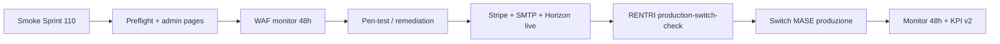

# GO-LIVE Produzione — Ciclo 9 chiusura infra

**Ciclo 9 chiuso · Sprint 110** · Sign-off produzione post-operativo (sprint 101–109).

Consolida: endpoint MUD MASE produzione, GPS provider adapter, Stripe prod preflight, pen-test OWASP prep, WAF deploy prep, RENTRI production switch, Horizon/SMTP volume, HA/backup drill, KPI business dashboard v2.

**Baseline ereditata:** [GO-LIVE-OPERATIVO.md](GO-LIVE-OPERATIVO.md) (ciclo 8) · [GO-LIVE-ENTERPRISE.md](GO-LIVE-ENTERPRISE.md) (ciclo 7) · [GO-LIVE-RENTRI.md](GO-LIVE-RENTRI.md).

---

## 1. Esito ciclo 9 (sprint 101–110)

| Sprint | Focus | Deliverable chiave | Stato |
|--------|-------|-------------------|-------|
| **101** | MUD telematico endpoint MASE produzione | `MudTelematicoEndpoints`, transmission live | ✅ |
| **102** | GPS provider adapter + geofencing | `TrasportoGpsProviderAdapter`, preflight UI | ✅ |
| **103** | Stripe produzione onboarding | `StripeProductionPreflightService`, webhook idempotency | ✅ |
| **104** | Pen-test OWASP esterno prep | `OwaspExternalPrepService`, `/admin/pen-test-prep` | ✅ |
| **105** | WAF deploy attivo staging/prod | `WafDeploymentPreflightService`, `/admin/waf-status` | ✅ |
| **106** | RENTRI produzione switch | `RentriProductionSwitchService`, CLI dry-run | ✅ |
| **107** | Horizon scaling + SMTP volume | `HorizonScalingPreflightService`, `SmtpVolumePreflightService` | ✅ |
| **108** | HA multi-istanza + backup drill | `HaBackupPreflightService`, `/admin/ha-status` | ✅ |
| **109** | KPI business dashboard v2 | `BusinessKpiDashboardService`, widget 7/30 gg | ✅ |
| **110** | Chiusura GO-LIVE-PRODUZIONE | questo documento + smoke Sprint 110 | ✅ |

**Suite test:** 750 PHPUnit (giugno 2026, 4 skipped integration sandbox). Piano: [CICLO-9-PIANO.md](CICLO-9-PIANO.md).

---

## 2. Deliverable consolidati per area

### 2.1 MUD telematico MASE (Sprint 101)

| Asset | Percorso |
|-------|----------|
| Endpoints sandbox/prod | `app/Domain/Mud/MudTelematicoEndpoints.php` |
| Transmission service | `app/Domain/Mud/MudTelematicoTransmissionService.php` |
| UI probe + submit URL | `MudShow` |
| Fixture | `tests/fixtures/mud/mase-invio-submit.json` |

**Env:** `MUD_TELEMATICO_STUB=false` · `MUD_TELEMATICO_ENV=production` · gateway `api.rentri.gov.it`.

**Portale SPID manuale:** [mudtelematico.it](https://www.mudtelematico.it)

---

### 2.2 GPS provider (Sprint 102)

| Asset | Percorso |
|-------|----------|
| Adapter field map | `app/Domain/Trasporti/TrasportoGpsProviderAdapter.php` |
| Preflight checklist | `TrasportoGpsPreflightService` · `TrasportoShow` |
| Geofencing alert | `TrasportoGpsGeofenceService` |
| Fixture | `tests/fixtures/trasporti/position-response.json` |

**Env:** `TRASPORTO_GPS_STUB=false` · `TRASPORTO_GPS_PROVIDER_URL` · `TRASPORTO_GPS_API_KEY`.

---

### 2.3 Stripe produzione (Sprint 103)

| Asset | Percorso |
|-------|----------|
| Preflight live/sandbox | `StripeProductionPreflightService` |
| Webhook idempotency | tabella `stripe_webhook_events` |
| Riconciliazione mail | `EcommerceStripeReconciliationMail` |
| UI badge | carrello / ordine e-commerce |

**Env:** `ECOMMERCE_PAYMENT_STUB=false` · `STRIPE_KEY=sk_live_...` · `STRIPE_LIVE_MODE=true` · `STRIPE_WEBHOOK_SECRET`.

**Webhook:** `POST /webhooks/stripe/ecommerce`

---

### 2.4 Pen-test OWASP esterno (Sprint 104)

| Asset | Percorso |
|-------|----------|
| Brief engagement | [PEN-TEST-EXTERNAL-SCOPE.md](PEN-TEST-EXTERNAL-SCOPE.md) |
| Remediation template | [REMEDIATION-FINDINGS-TEMPLATE.md](REMEDIATION-FINDINGS-TEMPLATE.md) |
| Checklist interna | [OWASP-INTERNAL-CHECKLIST.md](OWASP-INTERNAL-CHECKLIST.md) |
| Admin UI | `/admin/pen-test-prep` |
| Service | `OwaspExternalPrepService` |

---

### 2.5 WAF deploy (Sprint 105)

| Asset | Percorso |
|-------|----------|
| Regole prep | [WAF-RULES-PREP.md](WAF-RULES-PREP.md) |
| Rollout staging/prod | [WAF-STAGING-ROLLOUT.md](WAF-STAGING-ROLLOUT.md) |
| Admin UI | `/admin/waf-status` |
| Env | `WAF_MODE=off\|monitor\|block` |

**Sequenza:** 48h monitor → block mode · rollback documentato.

---

### 2.6 RENTRI production switch (Sprint 106)

| Asset | Percorso |
|-------|----------|
| Runbook switch/rollback | [RENTRI-PRODUCTION-SWITCH-RUNBOOK.md](RENTRI-PRODUCTION-SWITCH-RUNBOOK.md) |
| Service checklist | `RentriProductionSwitchService` |
| CLI dry-run | `php artisan rentri:production-switch-check --dry-run` |
| UI | Hub RENTRI · Impostazioni step 4 |

**Gate:** WAF block mode consigliato prima dello switch definitivo.

---

### 2.7 Horizon + SMTP volume (Sprint 107)

| Asset | Percorso |
|-------|----------|
| Horizon scaling runbook | [HORIZON-SCALING-RUNBOOK.md](HORIZON-SCALING-RUNBOOK.md) |
| Preflight services | `HorizonScalingPreflightService` · `SmtpVolumePreflightService` |
| UI checklist | `/segreteria/impostazioni/notifiche` |
| Monitoraggio | [MONITORING-CICLO-3.md](MONITORING-CICLO-3.md) §5–6 |

**Env:** `NOTIFICATIONS_QUEUE=true` · `QUEUE_CONNECTION=redis` · Horizon attivo · `NOTIFICATIONS_LIVE=true`.

---

### 2.8 HA + backup drill (Sprint 108)

| Asset | Percorso |
|-------|----------|
| Runbook HA/backup | [HA-BACKUP-DRILL-RUNBOOK.md](HA-BACKUP-DRILL-RUNBOOK.md) |
| Preflight service | `HaBackupPreflightService` |
| Redis multi-istanza | [REDIS-SESSION-PREP.md](REDIS-SESSION-PREP.md) |
| Admin UI | `/admin/ha-status` |
| Config | `config/infrastructure.php` → backup/ha |

---

### 2.9 KPI business v2 (Sprint 109)

| Asset | Percorso |
|-------|----------|
| Service metriche 7/30 gg | `BusinessKpiDashboardService` |
| Widget dashboard | `/segreteria` → sezione KPI business v2 |
| Soglie | `config/dashboard.php` → `business_kpi.thresholds` |
| Doc metriche | [KPI-BUSINESS-DASHBOARD-V2.md](KPI-BUSINESS-DASHBOARD-V2.md) |

**Metriche:** ordini e-commerce confermati · VFU accettate · movimenti magazzino kg · revenue stub ordini.

---

## 3. Smoke commands (pre/post deploy produzione)

### 3.1 Chiusura ciclo 9

```bash
cd new-rentri-crm
php -d memory_limit=512M vendor/bin/phpunit              # suite 750+ (4 skipped)
php artisan test --filter=Sprint110                       # doc + smoke chiusura ciclo 9
php artisan test --filter=Sprint109                       # KPI business v2
php artisan test --filter=Sprint106                       # RENTRI production switch
php artisan rentri:preflight                              # produzione
php artisan rentri:preflight --demo                       # demo/staging
php artisan rentri:production-switch-check --dry-run      # checklist switch MASE
php artisan rentri:monitor                                # health + dead-letter
```

### 3.2 Preflight admin (ciclo 9)

```bash
php artisan test --filter=OwaspExternalPrepTest           # pen-test prep
php artisan test --filter=WafDeploymentPreflightTest      # WAF status
php artisan test --filter=HaBackupPreflightTest           # HA / backup
php artisan test --filter=HorizonSmtpVolumePreflightTest  # Horizon + SMTP
php artisan test --filter=StripeProductionPreflightTest   # Stripe prod
```

**UI admin smoke (browser):**

- `/admin/pen-test-prep` — scope assets + checklist engagement
- `/admin/waf-status` — mode WAF + path protetti
- `/admin/ha-status` — backup schedule + RPO/RTO
- `/segreteria` — KPI business v2 (7/30 gg)
- `/segreteria/rentri` — switch produzione MASE card

### 3.3 Regression cicli 7–8

```bash
php artisan test --filter=Sprint100                       # GO-LIVE-OPERATIVO
php artisan test --filter=Sprint90                        # GO-LIVE-ENTERPRISE
php artisan test --filter=Sprint91                        # sandbox validation
```

### 3.4 E2E e load

```bash
npm run test:e2e
k6 run scripts/k6-smoke.js
K6_BASE_URL=http://127.0.0.1:8000 k6 run scripts/k6-authenticated.js
```

---

## 4. Checklist go/no-go produzione (unificata)

### 4.1 P0 — RENTRI e switch MASE

- [ ] Cert mTLS operatore validato (sandbox wizard + CI integration almeno una volta)
- [ ] `rentri:production-switch-check` SUCCESS (non dry-run) su staging pre-prod
- [ ] `RENTRI_ENV=production` · `RENTRI_API_STUB=false` · `RENTRI_FIRMA_STUB=false`
- [ ] Runbook [RENTRI-PRODUCTION-SWITCH-RUNBOOK.md](RENTRI-PRODUCTION-SWITCH-RUNBOOK.md) letto dal team ops
- [ ] Dead-letter = 0 o runbook attivo · `rentri:monitor` in cron 15 min
- [ ] WAF in `monitor` o `block` su path Stripe/Livewire/admin (Sprint 105)

### 4.2 P1 — Security e compliance

- [ ] Pen-test OWASP esterno schedulato o completato ([PEN-TEST-EXTERNAL-SCOPE.md](PEN-TEST-EXTERNAL-SCOPE.md))
- [ ] 2FA enforced admin/segreteria con grace period comunicato (ciclo 8)
- [ ] Remediation findings documentati se audit in corso ([REMEDIATION-FINDINGS-TEMPLATE.md](REMEDIATION-FINDINGS-TEMPLATE.md))
- [ ] Audit export e activity log operativi

### 4.3 P2 — Verticali business e infra

- [ ] MUD telematico — endpoint produzione configurati se obbligatorio normativo
- [ ] Stripe live — account business, webhook prod, idempotency verificata
- [ ] SMTP live + Horizon — volume notifiche testato da hub
- [ ] GPS provider — contratto API e field map validati con fornitore
- [ ] HA/backup — drill restore trimestrale pianificato ([HA-BACKUP-DRILL-RUNBOOK.md](HA-BACKUP-DRILL-RUNBOOK.md))
- [ ] KPI business v2 — soglie `business_kpi.thresholds` allineate ops

### 4.4 P3 — Qualità e regression

- [ ] PHPUnit 750+ verde · GO-LIVE-360 security sign-off ancora valido
- [ ] Playwright smoke palestra verde (opzionale pre-go-live)
- [ ] k6 smoke sotto soglia errori (opzionale)

---

## 5. Sequenza deploy consigliata (post ciclo 9)



1. Smoke §3.1 su staging con `.env` sandbox completo.
2. Verificare admin preflight: pen-test, WAF, HA (`/admin/*`).
3. WAF `monitor` → osservazione 48h → `block` ([WAF-STAGING-ROLLOUT.md](WAF-STAGING-ROLLOUT.md)).
4. Abilitare verticali live: SMTP/Horizon → Stripe → GPS → MUD (se richiesto).
5. `rentri:production-switch-check --dry-run` → fix checklist → switch reale.
6. Monitoraggio 48h: dead-letter, SLA, KPI business v2, log notifiche.
7. Backup drill entro 90 gg ([HA-BACKUP-DRILL-RUNBOOK.md](HA-BACKUP-DRILL-RUNBOOK.md)).

---

## 6. Handoff team infra

| Asset | Owner | Doc / UI |
|-------|-------|----------|
| Switch RENTRI produzione | Ops RENTRI | [RENTRI-PRODUCTION-SWITCH-RUNBOOK.md](RENTRI-PRODUCTION-SWITCH-RUNBOOK.md) |
| WAF rules + SIEM | DevOps | [WAF-STAGING-ROLLOUT.md](WAF-STAGING-ROLLOUT.md) · `/admin/waf-status` |
| Pen-test vendor | Security | [PEN-TEST-EXTERNAL-SCOPE.md](PEN-TEST-EXTERNAL-SCOPE.md) · `/admin/pen-test-prep` |
| HA / backup / Redis | DevOps | [HA-BACKUP-DRILL-RUNBOOK.md](HA-BACKUP-DRILL-RUNBOOK.md) · `/admin/ha-status` |
| Horizon workers | DevOps | [HORIZON-SCALING-RUNBOOK.md](HORIZON-SCALING-RUNBOOK.md) |
| Stripe keys prod | Business/DevOps | `StripeProductionPreflightService` |
| GPS provider contratto | Trasporti | `TrasportoGpsPreflightService` |
| KPI soglie business | Product/Ops | [KPI-BUSINESS-DASHBOARD-V2.md](KPI-BUSINESS-DASHBOARD-V2.md) |

---

## 7. Sign-off ciclo 9

| Ruolo | Nome | Data | Firma |
|-------|------|------|-------|
| Product / operazioni | | | |
| Tech lead | | | |
| Security referente | | | |
| DevOps / infra | | | |

**Esito ciclo 9:** ☐ Produzione approvata · ☐ GO con riserve · ☐ Rinviato

**Riserve documentate:**

---

## 8. Gap residui post-ciclo 9 (infra / contratto esterno)

Prep **completata in code e documentazione** — attivazione richiede azioni team esterno:

| # | Gap | Stato code | Azione residua |
|---|-----|------------|----------------|
| 1 | **Pen-test OWASP vendor** | Prep Sprint 104 ✅ | Engagement auditor esterno + remediation findings |
| 2 | **WAF attivo produzione** | Preflight + runbook ✅ | Deploy regole su CDN/load balancer (infra) |
| 3 | **RENTRI switch MASE reale** | Checklist + CLI ✅ | Esecuzione switch con cert operatore in produzione |
| 4 | **Stripe account live** | Preflight + webhook idempotency ✅ | Onboarding business account + webhook prod |
| 5 | **GPS provider contratto** | Adapter generico ✅ | Firma contratto + validazione field map fornitore |
| 6 | **HA multi-istanza live** | Runbook + preflight ✅ | Deploy seconda istanza + Redis session condiviso |
| 7 | **Backup restore drill** | Runbook trimestrale ✅ | Esecuzione drill e documentazione esito |
| 8 | **MUD endpoint normativo** | Gateway-aligned ✅ | Conferma path/SLA con aggiornamenti MASE |
| 9 | **Mobile app operatore** | Web responsive ✅ | App nativa — vedi [CICLO-10-PIANO-STUB.md](CICLO-10-PIANO-STUB.md) |
| 10 | **RENTRI cert produzione E2E** | Sandbox CI gated ✅ | Esercitazione cert prod + smoke ministeriale |

Prossimo piano suggerito: [CICLO-10-PIANO-STUB.md](CICLO-10-PIANO-STUB.md) (sprint 111–120).

---

## Riferimenti incrociati

| Documento | Contenuto |
|-----------|-----------|
| [GO-LIVE-OPERATIVO.md](GO-LIVE-OPERATIVO.md) | Checklist env ciclo 8 (baseline) |
| [GO-LIVE-RENTRI.md](GO-LIVE-RENTRI.md) | Go-live API RENTRI dettaglio |
| [CICLO-9-PIANO.md](CICLO-9-PIANO.md) | Piano sprint 101–110 (CHIUSO) |
| [RENTRI_VERTICAL_BACKLOG.md](RENTRI_VERTICAL_BACKLOG.md) §12 | Backlog ciclo 9 (CHIUSO) |
| [CICLO-10-PIANO-STUB.md](CICLO-10-PIANO-STUB.md) | Outline ciclo 10 |
