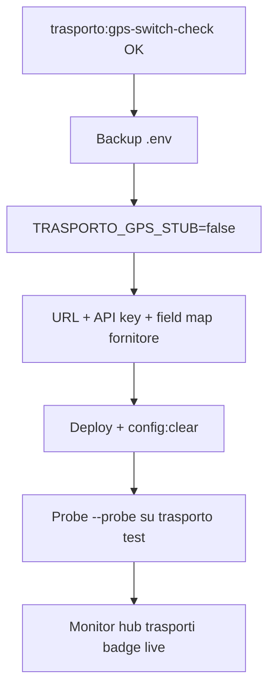

# GPS provider produzione — Runbook

**Sprint 116 · Ciclo 10** · Switch controllato da stub simulato a provider GPS live (`TRASPORTO_GPS_*`).

**Prerequisiti:** adapter Sprint 102 (`TrasportoGpsProviderAdapter`) · contratto fornitore in `tests/fixtures/gps/position-response.json`.

**Verifica:** `php artisan trasporto:gps-switch-check --dry-run` · hub `/segreteria/trasporti` · dettaglio trasporto in transito (preflight live).

---

## 1. Contratto fornitore

| Campo canonico CRM | Path default (flat) | Path nested fleet |
|--------------------|---------------------|-------------------|
| `latitude` | `latitude` | `location.lat` |
| `longitude` | `longitude` | `location.lng` |
| `recorded_at` | `recorded_at` | `timestamp` |
| `speed_kmh` | `speed_kmh` | `speed` |

**Endpoint atteso:** `GET {TRASPORTO_GPS_PROVIDER_URL}{TRASPORTO_GPS_POSITIONS_PATH}` con `{id}` sostituito dall’ID trasporto CRM.

**Auth:** header `Authorization: Bearer {TRASPORTO_GPS_API_KEY}`.

**Risposta:** JSON con coordinate mappabili via field map. Varianti documentate nel fixture:

- `flat_default` — chiavi top-level
- `nested_fleet` — oggetto `location` annidato

---

## 2. Gate pre-switch

| # | Gate | Verifica |
|---|------|----------|
| 1 | Stub disattivato | `TRASPORTO_GPS_STUB=false` |
| 2 | URL reale | `TRASPORTO_GPS_PROVIDER_URL` — no `example.com` |
| 3 | API key | `TRASPORTO_GPS_API_KEY` valorizzata |
| 4 | Field map | Preset `flat_default` o `nested_fleet` (vedi §3) |
| 5 | Path posizioni | `TRASPORTO_GPS_POSITIONS_PATH=/trasporti/{id}/position` |
| 6 | Switch check | `php artisan trasporto:gps-switch-check` — SUCCESS |
| 7 | Probe (opz.) | `--probe` con trasporto in transito o HTTP diretto |

---

## 3. Preset field map produzione

### flat_default (default env)

```env
TRASPORTO_GPS_FIELD_LAT=latitude
TRASPORTO_GPS_FIELD_LNG=longitude
TRASPORTO_GPS_FIELD_RECORDED_AT=recorded_at
TRASPORTO_GPS_FIELD_SPEED=speed_kmh
```

### nested_fleet

```env
TRASPORTO_GPS_FIELD_LAT=location.lat
TRASPORTO_GPS_FIELD_LNG=location.lng
TRASPORTO_GPS_FIELD_RECORDED_AT=timestamp
TRASPORTO_GPS_FIELD_SPEED=speed
```

Preset verificabili in UI hub trasporti (sezione «Preset field map produzione») e via `TrasportoGpsProductionSwitchService::productionFieldMapPresets()`.

---

## 4. Sequenza switch (ordinata)



### Step 1 — Backup

```bash
cp .env .env.pre-gps-live-$(date +%Y%m%d)
```

### Step 2 — Env produzione GPS

```env
TRASPORTO_GPS_STUB=false
TRASPORTO_GPS_PROVIDER_URL=https://api.fornitore-gps.it/v1
TRASPORTO_GPS_API_KEY=<token-fornitore>
TRASPORTO_GPS_POSITIONS_PATH=/trasporti/{id}/position
TRASPORTO_GPS_PROBE_TRANSPORT_ID=<id-trasporto-in-transito-opzionale>
# Field map — scegliere preset §3
```

### Step 3 — Verifica dry-run

```bash
php artisan config:clear
php artisan trasporto:gps-switch-check --dry-run
php artisan trasporto:gps-switch-check --probe --json
```

### Step 4 — Smoke UI

1. `/segreteria/trasporti` — badge modalità GPS + checklist switch verde
2. Aprire trasporto **in transito** — refresh posizione GPS live
3. Verificare `gps_last_position` aggiornato in DB

---

## 5. Fallback stub (rollback)

Se il provider non risponde o il field map non normalizza:

1. **`TRASPORTO_GPS_STUB=true`** — rollback immediato; posizioni simulate
2. **`php artisan config:clear`** — badge «GPS stub» su hub trasporti
3. **Notifica fornitore** — sospendere polling verso endpoint prod
4. **Dati esistenti** — `gps_last_position` resta in DB; nuovi refresh usano stub

Comando checklist rollback: vedi sezione «Rollback stub» in `/segreteria/trasporti` o `TrasportoGpsProductionSwitchService::rollbackSteps()`.

---

## 6. Geofencing (opzionale)

```env
TRASPORTO_GPS_GEOFENCE_ENABLED=true
TRASPORTO_GPS_GEOFENCE_DEST_LAT=45.4642
TRASPORTO_GPS_GEOFENCE_DEST_LNG=9.1914
TRASPORTO_GPS_GEOFENCE_RADIUS_KM=50
```

Voce checklist opzionale — abilitare solo se destinazione impianto nota.

---

## 7. Monitoraggio post-switch

| Segnale | Azione |
|---------|--------|
| Badge «GPS offline» | Verificare URL/API key; probe `--probe` |
| HTTP 401/403 | Ruotare API key con fornitore |
| Field map invalido | Allineare env a preset §3; confrontare fixture |
| Latency > timeout | Aumentare `TRASPORTO_GPS_TIMEOUT` o escalare vendor |

---

## Riferimenti

- [SPRINT-116-REVIEW-HANDOFF.md](SPRINT-116-REVIEW-HANDOFF.md)
- `tests/fixtures/gps/position-response.json`
- Sprint 102 — `TrasportoGpsProviderAdapter`, geofence, preflight dettaglio trasporto
