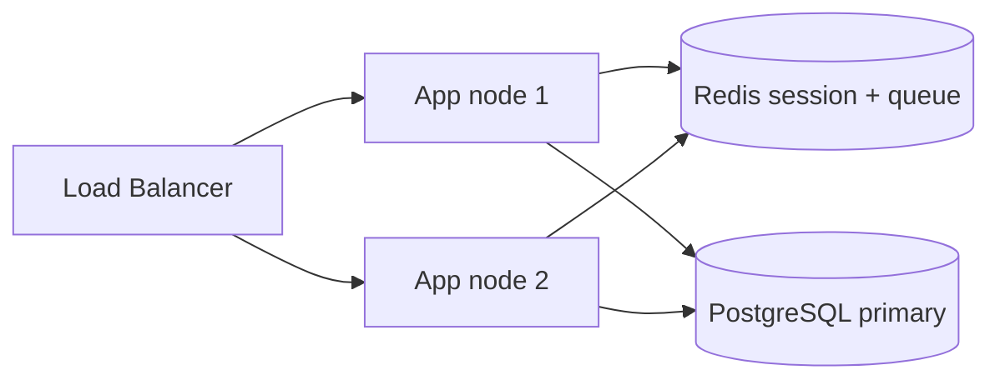

# HA multi-istanza + backup drill — Runbook

**Sprint 108 · Ciclo 9** · RPO/RTO, restore trimestrale, failover app.

**Verifica UI:** `/admin/ha-status` (admin) · Service: `HaBackupPreflightService`.

---

## 1. Target RPO / RTO

| Metrica | Target default | Config |
|---------|----------------|--------|
| **RPO** (Recovery Point Objective) | ≤ 1 ora | `HA_RPO_MINUTES=60` |
| **RTO** (Recovery Time Objective) | ≤ 4 ore | `HA_RTO_MINUTES=240` |

**RPO** = perdita dati massima accettabile (frequenza backup).  
**RTO** = tempo massimo per ripristino servizio dopo incidente.

---

## 2. Backup DB

### Config produzione

```env
DB_BACKUP_SCHEDULE_ENABLED=true
DB_BACKUP_CRON="0 2 * * *"
DB_BACKUP_RETENTION_DAYS=30
DB_BACKUP_STORAGE_PATH=s3://rentri-crm-backups/prod
DB_BACKUP_LAST_DRILL_AT=2026-06-01
```

### Schedule consigliato

| Ambiente | Frequenza | Retention |
|----------|-----------|-----------|
| Staging | Daily 02:00 UTC | 7 giorni |
| Produzione | Daily 02:00 UTC + weekly full | 30 giorni |
| Demo | Weekly | 7 giorni |

### Verifica backup

```bash
# Lista backup (esempio S3)
aws s3 ls s3://rentri-crm-backups/prod/ --recursive | tail

# Preflight HA
# UI: /admin/ha-status
```

---

## 3. Restore drill trimestrale

Eseguire **ogni 3 mesi** (`HA_BACKUP_DRILL_INTERVAL_MONTHS=3`) su **staging** (non prod live).

### Procedura drill

1. Selezionare backup ≤ 24h su staging bucket.
2. Provisionare DB temporaneo `rentri_crm_drill_YYYYMMDD`.
3. Restore dump/pg_restore.
4. `php artisan migrate --force` (verificare allineamento schema).
5. Smoke:
   - `php artisan rentri:preflight --demo`
   - Login segreteria
   - Query conteggio VFU/ordini vs snapshot atteso
6. Documentare durata restore → confronto RTO.
7. Aggiornare `DB_BACKUP_LAST_DRILL_AT` in env produzione/staging.
8. Distruggere DB drill.

### Sign-off drill

| Campo | Valore |
|-------|--------|
| Data | |
| Backup usato | |
| Durata restore | min |
| RTO rispettato | ☐ |
| Esecutore | |

---

## 4. Failover multi-istanza

### Architettura target



### Prerequisiti

- `SESSION_DRIVER=redis` — [REDIS-SESSION-PREP.md](REDIS-SESSION-PREP.md)
- `QUEUE_CONNECTION=redis` + Horizon su ogni nodo (o dedicato)
- Sticky session **non** richiesta se Redis session attivo
- Health check `/up` su LB

### Failover steps

1. Rilevare nodo unhealthy (5xx su `/up`).
2. LB drain → rimuovere da pool.
3. Verificare Redis replica / failover automatico.
4. Confermare Horizon worker su nodo sano.
5. Smoke: login, Livewire, `rentri:monitor`.
6. Post-mortem entro 24h.

### Rollback failover errato

Reintegrare nodo dopo fix; verificare sessioni non perse (Redis centralizzato).

---

## 5. Checklist go-live HA

- [ ] `HaBackupPreflightService` — tutte voci OK in `/admin/ha-status`
- [ ] Backup daily attivo + retention ≥ 30 gg prod
- [ ] Restore drill documentato ultimo trimestre
- [ ] Redis session su staging 2 nodi testato 48h
- [ ] Runbook condiviso ops + on-call

---

## Riferimenti

- [REDIS-SESSION-PREP.md](REDIS-SESSION-PREP.md)
- [HORIZON-SCALING-RUNBOOK.md](HORIZON-SCALING-RUNBOOK.md)
- [MONITORING-CICLO-3.md](MONITORING-CICLO-3.md)
- [SPRINT-108-AUDIT-NOTES.md](SPRINT-108-AUDIT-NOTES.md)

---

*Runbook Sprint 108 — backup infra = team DevOps; CRM espone preflight e UI admin.*
