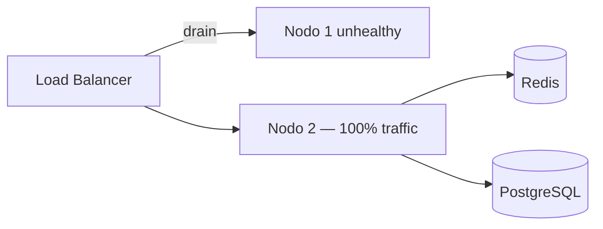

# HA failover drill — Runbook esercitazione multi-istanza

**Sprint 118 · Ciclo 10** · Esercitazione controllata failover app node + rollback post-drill.

**Prerequisiti:** [HA-BACKUP-DRILL-RUNBOOK.md](HA-BACKUP-DRILL-RUNBOOK.md) · [REDIS-SESSION-PREP.md](REDIS-SESSION-PREP.md)

**Verifica:** `php artisan ha:failover-drill --dry-run --probe` · UI `/admin/ha-status`

---

## 1. Gate pre-drill

| # | Gate | Verifica |
|---|------|----------|
| 1 | Preflight HA | `HaBackupPreflightService` OK in `/admin/ha-status` |
| 2 | 2+ istanze | `HA_MIN_APP_INSTANCES=2` |
| 3 | URL nodi | `HA_PRIMARY_APP_URL` + `HA_SECONDARY_APP_URL` |
| 4 | Redis session | `SESSION_DRIVER=redis` |
| 5 | Queue Redis | `QUEUE_CONNECTION=redis` + Horizon |
| 6 | Health route | `GET /up` su entrambi i nodi |
| 7 | Drill check | `php artisan ha:failover-drill` — SUCCESS |

**Ambiente:** eseguire drill su **staging** — non su produzione live senza change window.

---

## 2. Config esercitazione

```env
HA_PRIMARY_APP_URL=https://app1.staging.example.com
HA_SECONDARY_APP_URL=https://app2.staging.example.com
HA_MIN_APP_INSTANCES=2
HA_LAST_FAILOVER_DRILL_AT=2026-06-01
HA_FAILOVER_DRILL_INTERVAL_MONTHS=6
HA_RTO_MINUTES=240
SESSION_DRIVER=redis
QUEUE_CONNECTION=redis
```

---

## 3. Fase 1 — Health verification

```bash
php artisan ha:failover-drill --probe
```

| Step | Azione | Esito atteso |
|------|--------|--------------|
| 1 | GET `/up` nodo primario | HTTP 200 |
| 2 | GET `/up` nodo secondario | HTTP 200 |
| 3 | Redis session/queue | Entrambi i nodi connessi |
| 4 | Horizon | `horizon:status` running su ≥1 nodo |

---

## 4. Fase 2 — Switch traffic (simulazione)



| Step | Azione |
|------|--------|
| 1 | Drain nodo primario dal target group LB |
| 2 | Confermare 100% traffico su secondario |
| 3 | Smoke: login segreteria, Livewire, `rentri:monitor` |
| 4 | Misurare tempo failover vs RTO (`HA_RTO_MINUTES`) |

---

## 5. Fase 3 — Recovery post-drill

| Check | Verifica |
|-------|----------|
| Primario ripristinato | GET `/up` 200 |
| LB ribilanciato | Entrambi i nodi in pool |
| Sessioni intatte | Login pre-esistente funzionante |
| Timestamp drill | `HA_LAST_FAILOVER_DRILL_AT` aggiornato |
| Post-mortem | Entro 24h su staging |

---

## 6. Rollback post-drill

1. **Reintegrare nodo primario** — health `/up` OK prima del traffico
2. **Ribilanciamento LB** — weight 50/50 o policy originale
3. **Horizon** — un solo leader consigliato; evitare doppio job processing
4. **Aggiornare env** — `HA_LAST_FAILOVER_DRILL_AT=YYYY-MM-DD`
5. **Smoke finale** — entrambi i nodi: login, KPI, `rentri:preflight --demo`

### Rollback failover errato (incidente reale)

Se failover accidentale in produzione:

1. Ripristinare configurazione LB originale
2. Verificare Redis cluster / replica promossa
3. Confermare nessuna perdita sessione (Redis centralizzato)
4. Post-mortem entro 24h — vedi [MONITORING-CICLO-3.md](MONITORING-CICLO-3.md)

---

## 7. Sign-off drill

| Campo | Valore |
|-------|--------|
| Data | |
| Ambiente | staging |
| Durata switch | min |
| RTO rispettato | ☐ |
| Rollback completato | ☐ |
| HA_LAST_FAILOVER_DRILL_AT | |
| Esecutore | |

---

## Riferimenti

- [HA-BACKUP-DRILL-RUNBOOK.md](HA-BACKUP-DRILL-RUNBOOK.md)
- [HORIZON-SCALING-RUNBOOK.md](HORIZON-SCALING-RUNBOOK.md)
- [SPRINT-118-REVIEW-HANDOFF.md](SPRINT-118-REVIEW-HANDOFF.md)
