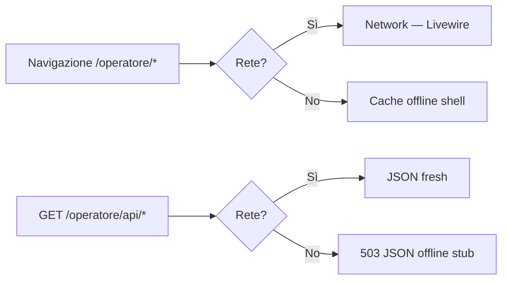

# Operatore PWA — API mobile e strategia cache/offline

**Sprint 115 · Ciclo 10** · Area `/operatore/*` installabile come PWA con API JSON read-only.

---

## 1. Architettura

| Layer | Ruolo |
|-------|--------|
| **Livewire UI** | Bonifica, ricambi, vetrina — flusso attuale tablet/mobile |
| **API JSON read-only** | Prep app nativa / integrazioni mobile (`OperatoreMobileApiService`) |
| **PWA shell** | Manifest + service worker — installazione home screen, offline fallback |
| **HasDemoScope** | Modelli VFU/e-commerce filtrati per `is_demo`; API espone `demo_mode` |

---

## 2. API read-only (operatore)

**Base:** `/operatore/api/*` · **Auth:** session cookie + ruolo `operatore|admin|editor` · **Middleware:** `demo.scope`

| Endpoint | Descrizione | Policy |
|----------|-------------|--------|
| `GET /operatore/api/bonifica` | Veicoli da bonificare | `bonifica.viewAny` |
| `GET /operatore/api/ricambi` | Catalogo ricambi disponibili | `viewAny` EcommerceProdotto |
| `GET /operatore/api/vetrina` | Ricambi in evidenza | `viewAny` EcommerceProdotto |

### Query params

**Bonifica:** `q`, `filtro` (`tutti|scaduti|in_tempo|dopo_pericolosi`)

**Ricambi:** `q`, `categoria`, `per_page` (max 100)

**Vetrina:** `limit` (max 24)

### Envelope risposta

```json
{
  "api_version": 1,
  "demo_mode": false,
  "generated_at": "2026-06-04T12:00:00+00:00",
  "count": 1,
  "veicoli": []
}
```

**Write operations** (upload foto, bonifica wizard) restano su Livewire — fuori scope API Sprint 115.

---

## 3. PWA installazione

| Asset | Path |
|-------|------|
| Web manifest | `/operatore/manifest.webmanifest` |
| Service worker | `/operatore-sw.js` (scope `/operatore/`) |
| Offline fallback | `/operatore-offline.html` |
| Registrazione SW | Inline script in `layouts/operatore.blade.php` |

### Install (Chrome / Safari iOS)

1. Login operatore → `/operatore`
2. Browser → «Aggiungi a schermata Home» / «Installa app»
3. Manifest: `display: standalone`, `start_url: /operatore`

Config: `config/operatore.php` · env `OPERATORE_PWA_*`.

---

## 4. Strategia cache / offline



| Tipo richiesta | Strategia | Note |
|----------------|-----------|------|
| Navigazione HTML `/operatore/*` | Network-first → fallback offline page | Shell messaggio «Sei offline» |
| API JSON `/operatore/api/*` | Network-only → 503 offline | No stale write; read-only |
| Asset statici Vite | Browser cache standard | — |
| Livewire POST | Richiede rete | Bonifica/upload non offline |

**Future (Sprint 116+):** cache read-through API vetrina/ricambi con TTL 5 min per consultazione offline catalogo.

---

## 5. Demo scope

- `VfuRegistration`, `EcommerceProdotto` usano `HasDemoScope` → query API rispettano `DemoContext::isActive()`.
- Campo `demo_mode` in ogni risposta API per client mobile.
- Middleware `demo.scope` su route operatore (revoca session demo non autorizzata).

---

## 6. Smoke

```bash
php artisan test --filter=Sprint115
curl -b cookies.txt https://staging.example.test/operatore/api/bonifica
curl -b cookies.txt https://staging.example.test/operatore/api/ricambi?per_page=12
```

---

## Riferimenti

- [CICLO-10-PIANO.md](CICLO-10-PIANO.md)
- [SPRINT-115-REVIEW-HANDOFF.md](SPRINT-115-REVIEW-HANDOFF.md)
- `OperatoreMobileApiService.php`

---

*Sprint 115 — PWA operatore + API prep mobile nativo.*
