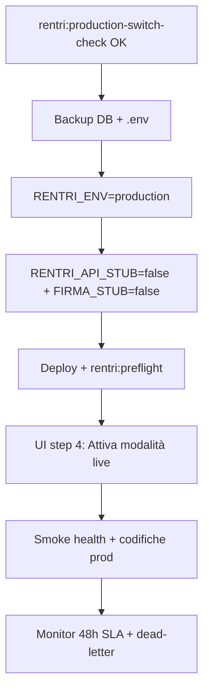

# RENTRI production switch — Runbook

**Sprint 106 · Ciclo 9** · Switch controllato verso `api.rentri.gov.it`.

**Prerequisiti:** [GO-LIVE-RENTRI.md](GO-LIVE-RENTRI.md) · WAF block consigliato ([WAF-STAGING-ROLLOUT.md](WAF-STAGING-ROLLOUT.md)) · pen-test prep ([PEN-TEST-EXTERNAL-SCOPE.md](PEN-TEST-EXTERNAL-SCOPE.md).

**Verifica:** `php artisan rentri:production-switch-check --dry-run` · UI hub RENTRI · Impostazioni step 4.

---

## 1. Gate pre-switch

| # | Gate | Verifica |
|---|------|----------|
| 1 | Sandbox validato | Wizard «Test reale MASE» verde su demoapi |
| 2 | CI integration | Workflow `rentri-sandbox-integration` almeno 1 run OK |
| 3 | WAF | `WAF_MODE=block` consigliato (opzionale ma P1 infra) |
| 4 | Preflight | `php artisan rentri:preflight` — 0 FAIL |
| 5 | Switch check | `php artisan rentri:production-switch-check` — SUCCESS |
| 6 | Certificati prod | mTLS + firma xFIR non scaduti, distinti |

---

## 2. Sequenza switch (ordinata)



### Step 1 — Backup

```bash
# Backup DB e snapshot .env corrente (rollback rapido)
cp .env .env.pre-rentri-prod-$(date +%Y%m%d)
```

### Step 2 — Env produzione

```env
RENTRI_ENV=production
RENTRI_API_STUB=false
RENTRI_FIRMA_STUB=false
RENTRI_BASE_URL_PRODUCTION=https://api.rentri.gov.it
RENTRI_VERIFY_SSL=true
APP_ENV=production
APP_DEBUG=false
```

### Step 3 — Deploy e preflight

```bash
php artisan migrate --force
php artisan rentri:preflight
php artisan rentri:production-switch-check --dry-run
```

### Step 4 — UI passaggio live

1. `/segreteria/impostazioni/rentri?step=4`
2. Verificare checklist unificata **tutte OK**
3. **Attiva modalità live** → activity log:
   - `Passaggio modalità live RENTRI (stub disabilitato via UI)`
   - `causer_id`, `checklist_summary` in properties JSON

### Step 5 — Smoke produzione

| Test | Esito atteso |
|------|--------------|
| Test connessione impostazioni | Health OK su api.rentri.gov.it |
| Codifiche CER | Count > 0 |
| Trasmissione registro (periodo test) | Protocollo MASE |
| Hub SLA | Nessun dead-letter |

---

## 3. Monitoraggio 48h post-switch

| Segnale | Tool | Soglia |
|---------|------|--------|
| Dead-letter | `/segreteria/rentri/transazioni` | 0 |
| SLA P95 latency | Hub RENTRI | < RENTRI_SLA_P95_LATENCY_SECONDS |
| Error rate 5xx | Log Laravel + WAF SIEM | Baseline |
| Cert scadenza | Impostazioni RENTRI | > 30 gg |

```bash
php artisan rentri:monitor          # ogni 15 min (cron prod)
php artisan rentri:production-switch-check  # spot check giornaliero
```

**Activity log:** filtrare modulo `rentri` per eventi switch/rollback.

---

## 4. Rollback

Eseguire in ordine se errori critici o dead-letter non risolvibili:

| Step | Azione | Tempo |
|------|--------|-------|
| 1 | `RENTRI_API_STUB=true` in .env | Immediato |
| 2 | `RENTRI_FIRMA_STUB=true` | Immediato |
| 3 | UI «Rientra in stub» (step 4) | Immediato |
| 4 | Redeploy / config cache clear | 5–15 min |
| 5 | Opzionale `RENTRI_ENV=sandbox` | Se rollback totale |
| 6 | Activity log audit + post-mortem | 24h |

**Activity log rollback UI:**

```
Rientro modalità stub RENTRI (override UI disattivato)
```

### Comandi rollback rapido

```bash
# Dopo modifica .env
php artisan config:clear
php artisan rentri:preflight
php artisan rentri:monitor
```

---

## 5. Sign-off

| Ruolo | Nome | Data | Switch | Rollback testato |
|-------|------|------|--------|------------------|
| Segreteria RENTRI | | | ☐ | ☐ |
| Tech lead | | | ☐ | ☐ |
| Ops | | | ☐ | ☐ |

---

## Riferimenti

- `RentriProductionSwitchService` — checklist unificata
- [GO-LIVE-OPERATIVO.md](GO-LIVE-OPERATIVO.md) §2.2 RENTRI
- [VALIDAZIONE-SANDBOX-MASE.md](VALIDAZIONE-SANDBOX-MASE.md)
- [MONITORING-CICLO-3.md](MONITORING-CICLO-3.md)

---

*Runbook Sprint 106 — non eseguire switch produzione senza certificati MASE reali e UAT approvato.*
