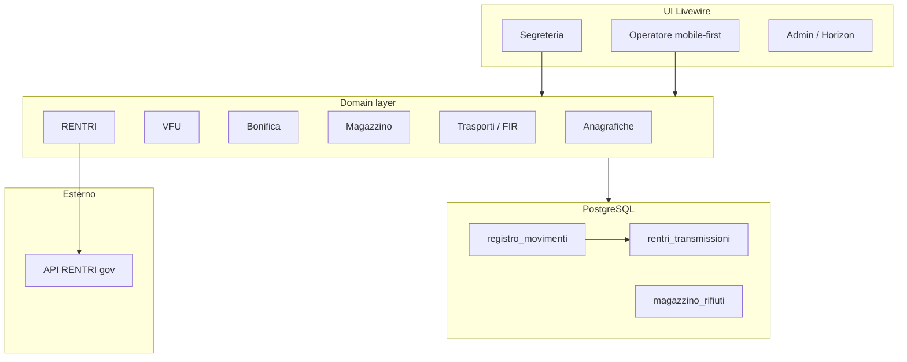
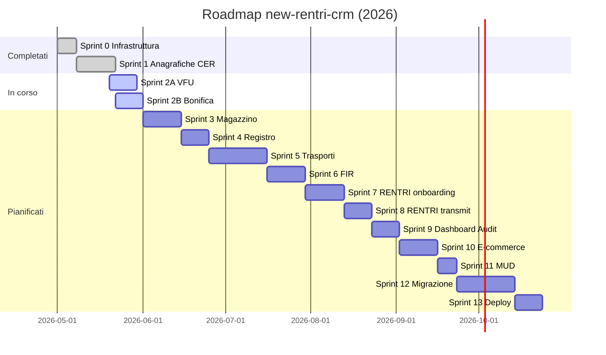

# Roadmap completa — RENTRI CRM (`new-rentri-crm`)

**Versione documento:** 1.0  
**Data redazione:** 24 maggio 2026  
**Ambito:** stato reale del repository al momento della scrittura (ispezione codice, test, route, migrazioni).

---

## Indice

1. [Introduzione](#introduzione)
2. [Stato attuale del progetto](#stato-attuale-del-progetto)
3. [Macro-aree (dettaglio)](#macro-aree-dettaglio)
4. [Roadmap temporale](#roadmap-temporale)
5. [Appendice](#appendice)

---

## Introduzione

### Visione e callback del progetto

Il progetto **new-rentri-crm** è un CRM enterprise per centri di **autodemolizione**, pensato per sostituire progressivamente il monolite **backend Laravel API + frontend statico** (`backend/`, `frontend/`) con un’unica applicazione **Laravel 12 + Livewire 4**.

Obiettivi di prodotto (callback):

| Obiettivo | Descrizione |
|-----------|-------------|
| **Tracciabilità normativa** | Ogni carico/scarico passa da `registro_movimenti` e, periodicamente, da trasmissioni RENTRI (`rentri_transmissioni`). |
| **Magazzino per CER** | Giacenze aggregate (`magazzino_rifiuti`) con `oldest_load_date` per retention e alert. |
| **VFU end-to-end** | Accettazione veicolo → documenti → bonifica pericolosi → movimenti CER → magazzino. |
| **Trasporti e FIR** | Scarico verso destinatario autorizzato con vidimazione FIR digitale RENTRI. |
| **Onboarding RENTRI** | Certificato, vidima registro, sync codifiche CER, health check. |

Il prototipo UI/UX di riferimento storico è anche **CRM-AutoDemolizioni/** (Next.js mock); il target di produzione è **solo** `new-rentri-crm/`.

### Architettura target



**Principi architetturali:**

- **Ledger unico:** `registro_movimenti` è la fonte di verità per carichi/scarichi (sostituisce `rentri_movimenti` / batch sparsi del legacy).
- **Domain services** in `app/Domain/{Anagrafiche,Vfu,Bonifica,Magazzino,...}/` — logica business fuori dai componenti Livewire.
- **Integrazione RENTRI** in `app/Services/Rentri/` con interfacce + binding in `AppServiceProvider` (stub oggi, implementazione reale in sprint dedicati).
- **RBAC:** Spatie Permission (`admin`, `editor`, `segreteria`, `operatore`) + policy Laravel per risorse.
- **Audit:** Spatie Activity Log (config pubblicata; UI admin ancora placeholder).

### Stack tecnologico

| Layer | Tecnologia | Note |
|-------|------------|------|
| Runtime | PHP 8.2+ | |
| Framework | Laravel 12 | |
| UI | Livewire 4.3 | Full-page components, `wire:navigate` |
| CSS | Tailwind 4 + `gestionale.css` | Layout segreteria desktop |
| DB prod | PostgreSQL 15+ | `json`/`jsonb` su settings/transmissioni |
| DB dev/test | SQLite | `migrate:fresh --seed`, PHPUnit |
| Auth | Session + `users` + Spatie roles | LoginController, middleware `role:` |
| Code async | Horizon 5 + queue `database` | `/horizon` solo admin |
| PDF VFU | `smalot/pdfparser` | Estrazione certificato rottamazione |
| Audit | `spatie/laravel-activitylog` | |
| Asset | Vite 6 | `npm run build` |

**Documentazione di riferimento nel monorepo:**

| File | Contenuto |
|------|-----------|
| `docs/new-rentri-crm/ARCHITECTURE.md` | Domini, servizi RENTRI, registro movimenti |
| `docs/new-rentri-crm/DATABASE.md` | Schema tabelle e FK |
| `docs/new-rentri-crm/DB-ALIGNMENT.md` | Allineamento vs legacy, seeders |
| `docs/new-rentri-crm/SPRINT-1.md` | Anagrafiche + CER completati |
| `docs/new-rentri-crm/SPRINT-0-1-REVIEW.md` | Review qualità Sprint 0–1 |

> **Nota:** dettaglio Sprint 2 in `docs/new-rentri-crm/SPRINT-2.md` e `new-rentri-crm/docs/SPRINT-2.md` (aggiornato 2026-05-25).

---

## Stato attuale del progetto

### Riepilogo sprint

| Sprint | Focus | Stato complessivo |
|--------|-------|-------------------|
| **0** | Infrastruttura, auth, schema DB, stub RENTRI, placeholder UI | ✅ Completato (core) |
| **1** | Anagrafiche + Codici CER CRUD | ✅ Completato |
| **2A** | VFU accettazione (segreteria) | ✅ Completato (core UI + registro + magazzino accettazione) |
| **2B** | Bonifica operatore | ✅ Completato (lista + wizard + test HTTP/domain) |
| **3+** | Magazzino, trasporti, FIR, RENTRI, MUD, e-commerce, deploy | ⬜ Da fare (placeholder) |

### Sprint 0 — Infrastruttura & Auth

**Moduli / file implementati:**

| Area | Path principali |
|------|-----------------|
| Auth | `app/Http/Controllers/Auth/LoginController.php`, `resources/views/auth/login.blade.php` |
| Middleware ruoli | `bootstrap/app.php` (alias `role`, `permission`) |
| Layout | `resources/views/layouts/segreteria.blade.php`, `operatore.blade.php`, `components/sidebar-nav.blade.php` |
| Migrazioni business | `database/migrations/2026_05_24_100001` … `100018` |
| Modelli Eloquent | `app/Models/*` (18 modelli business) |
| Enum | `app/Enums/VfuStato.php`, `RegistroMovimentoTipo.php`, `TrasportoStato.php`, `FirStato.php`, `VfuTipoDocumento.php` |
| Stub RENTRI | `app/Services/Rentri/*` + `Contracts/` + `Dto/TransmissionPayload.php` |
| Horizon | `config/horizon.php`, route redirect `admin/horizon` |
| Placeholder moduli | `SegreteriaPlaceholderPage`, `PlaceholderPage` |

**Route disponibili (Sprint 0):**

- `GET/POST /login`, `POST /logout`
- Gruppi `segreteria/*`, `operatore/*`, `admin/*` (placeholder)
- `GET /horizon` (package)

**Test:** inclusi in suite globale (login page smoke).

**Funziona vs placeholder:**

| Funziona | Placeholder |
|----------|-------------|
| Login/logout, redirect per ruolo | Dashboard segreteria (card “in costruzione”) |
| Migrazioni + seed CER/settings | Magazzino, trasporti, FIR, RENTRI trasmissione, MUD, e-commerce |
| Horizon access admin | Audit admin, profilo operatore, ricambi |

---

### Sprint 1 — Anagrafiche & Codici CER

**Moduli implementati:**

| Componente | File |
|------------|------|
| Domain | `app/Domain/Anagrafiche/AnagraficaService.php`, `AuthorizationComplianceService.php` |
| Domain CER | `app/Domain/Magazzino/CodiceCerService.php` |
| Livewire | `AnagraficheIndex`, `AnagraficaForm`, `AnagraficaShow`, `CodiciCerIndex`, `CodiceCerForm` |
| Policy | `AnagraficaPolicy`, `CodiceCerPolicy` |
| Form requests | `app/Http/Requests/Anagrafica/*`, `CodiceCer/*` |
| Viste | `resources/views/livewire/segreteria/anagrafiche/*`, `codici-cer/*` |
| Stili | `resources/css/gestionale.css` |

**Route:**

| Metodo | URI | Nome |
|--------|-----|------|
| GET | `/segreteria/anagrafiche` | `segreteria.anagrafiche` |
| GET | `/segreteria/anagrafiche/nuovo` | `segreteria.anagrafiche.create` |
| GET | `/segreteria/anagrafiche/{anagrafica}` | `segreteria.anagrafiche.show` |
| GET | `/segreteria/anagrafiche/{anagrafica}/modifica` | `segreteria.anagrafiche.edit` |
| GET | `/segreteria/codici-cer` | `segreteria.codici-cer.index` |
| GET | `/segreteria/codici-cer/nuovo` | `segreteria.codici-cer.create` |
| GET | `/segreteria/codici-cer/{codiceCer}/modifica` | `segreteria.codici-cer.edit` |

**Test passing (Sprint 1 — eseguiti 24/05/2026):**

```
Tests\Feature\Sprint1\AnagraficaAuthorizationTest (2)
Tests\Feature\Sprint1\AnagraficaServiceTest (5)
Tests\Feature\Sprint1\CodiceCerServiceTest (3)
Tests\Feature\Sprint1\CodiciCerAuthorizationTest (1)
Tests\Feature\ExampleTest, Tests\Unit\ExampleTest
```

**Funziona:** CRUD anagrafiche con tabella `authorizations`, badge conformità (scadenza &lt; 15 gg), CRUD codici CER con disattivazione se movimenti, init giacenza zero su create CER.

**Placeholder:** filtri legacy `per_svuotamento` / `per_trasporto` non portati; paginazione lista CER assente (WARN in review).

---

### Sprint 2A — VFU Accettazione (stato al 24/05/2026)

**Moduli implementati:**

| Layer | File |
|-------|------|
| Domain | `VfuAccettazioneService`, `VfuDocumentService` |
| PDF | `CertificatoRottamazionePdfService` (port da legacy) |
| Livewire | `VfuIndex`, `VfuAccettazioneWizard`, `VfuShow` |
| Policy | `VfuRegistrationPolicy` |
| Migration | `2026_05_24_200001_add_vfu_accettazione_fields.php` |
| Factory | `VfuRegistrationFactory` |

**Route:**

| URI | Componente |
|-----|------------|
| `/segreteria/vfu` | `VfuIndex` |
| `/segreteria/vfu/nuovo` | `VfuAccettazioneWizard` |
| `/segreteria/vfu/{vfuRegistration}` | `VfuShow` |
| `/segreteria/vfu/{vfuRegistration}/modifica` | `VfuAccettazioneWizard` |

**Viste presenti / mancanti:**

| Vista | Stato |
|-------|--------|
| `livewire/segreteria/vfu/index.blade.php` | ✅ Presente |
| `livewire/segreteria/vfu/wizard.blade.php` | ✅ Presente |
| `livewire/segreteria/vfu/show.blade.php` | ✅ Presente |
| `livewire/segreteria/vfu.blade.php` | Obsoleto (placeholder “in costruzione”; non usato da `VfuIndex`) |

**Funziona (logica backend):**

- Lista VFU con KPI, filtri stato/search, delete
- Wizard 4 step (logica Livewire): bozza, upload documenti, estrazione PDF certificato, `completeAccettazione`
- Creazione `registro_movimenti` carico CER `16.01.04*` su accettazione
- Stub `inviaAgenzia`

**Gap residui Sprint 2A (fuori scope Sprint 2):**

1. Generazione PDF certificato rottamazione **definitivo** (port completo legacy).
2. Invio agenzia reale (oggi stub `inviaAgenziaStub`).
3. Notifiche email documentazione VFU.

**Completato Sprint 2A:** viste wizard/show, `completeAccettazione` → stato `accettato`, carico registro CER `16.01.04*` + `MagazzinoService::addPeso`, test Feature `VfuAccettazioneTest`.

---

### Sprint 2B — Bonifica operatore (stato al 24/05/2026)

**Moduli implementati:**

| Layer | File |
|-------|------|
| Domain | `BonificaService`, `BonificaMovimentoService` |
| Magazzino | `MagazzinoService::addPeso` (usato da bonifica, lock pessimistico) |
| Livewire | `Bonifica` (lista), `BonificaWizard` |
| Vista wizard | `resources/views/livewire/operatore/bonifica-wizard.blade.php` ✅ |
| Vista lista | `resources/views/livewire/operatore/bonifica.blade.php` ✅ |
| Seeder test | `BonificaTestSeeder` (non in `DatabaseSeeder`) |

**Route:**

| URI | Stato |
|-----|--------|
| `GET /operatore/bonifica` | ✅ Registrata |
| `GET /operatore/bonifica/{vfu}` (wizard) | ✅ `operatore.bonifica.wizard` |

**Funziona (logica):**

- Fasi pericolosi / altri, scadenza 30 gg, sync movimenti, lock CER già trasmessi a RENTRI
- `registerCarichi` → `registro_movimenti` + `magazzino_rifiuti`

**Gap residui Sprint 2B:** email/PDF bonifica pericolosi (legacy), parity UX mobile avanzata.

**Completato Sprint 2B:** route wizard, query bonifica include `accettato` / `attesa_bonifica` / `in_bonifica`, seed `operatore@example.com`, test `BonificaServiceTest` + `BonificaHttpTest`.

**Test passing Sprint 2 (24 test, 49 asserzioni — `php artisan test`):**

```
Tests\Feature\Sprint2\VfuAccettazioneTest (5)
Tests\Feature\Sprint2\BonificaServiceTest (3)
Tests\Feature\Sprint2\BonificaHttpTest (3)
```

---

### Credenziali demo

| Email | Password | Ruolo | Note |
|-------|----------|-------|------|
| `admin@example.com` | `password` | `admin` | Home → `/admin/audit`; accesso Horizon |
| `segreteria@example.com` | `password` | `segreteria` | Home → `/segreteria` |
| `operatore@example.com` | `password` | `operatore` | Home → `/operatore`; bonifica mobile-first |

**Dati demo local** (`DemoDataSeeder`, solo `APP_ENV=local`):

- Trasportatore P.IVA `12345678901` con autorizzazione valida
- Impianto P.IVA `98765432109`

**VFU test bonifica** (seeder manuale):

```bash
php artisan db:seed --class=BonificaTestSeeder
```

Crea targhe `BN001TE`, `BN002TE` (solo `local`/`testing`).

---

## Macro-aree (dettaglio)

Per ogni area: obiettivo, stato, legacy, nuovo CRM, gap, task, dipendenze, effort, done, RENTRI/FIR.

---

### 1. Infrastruttura & Auth (Sprint 0)

| Campo | Valore |
|-------|--------|
| **Obiettivo business** | Accesso sicuro per ruoli operativi; base per audit e deploy. |
| **Stato attuale** | ✅ Fatto (core) |
| **Legacy** | `backend/app/Http/Controllers/Api/AuthController.php` (OTP admin, access codes); frontend `src/admin-login.js`, session API |
| **new-rentri-crm** | `LoginController`, Spatie roles, `RolePermissionSeeder`, middleware `role:` su route groups, SQLite/PG, Horizon |
| **Gap** | Utente operatore demo; permessi granulari Spatie; CI pipeline; `.env` RENTRI allineato a `config/services.php` |
| **Prossimi task** | 1. Aggiungere `operatore@example.com` al seeder. 2. Test HTTP login + redirect per ruolo. 3. GitHub Actions: `composer test` + `migrate:fresh --seed`. 4. Documentare Redis per queue prod. |
| **Dipendenze** | Nessuna |
| **Stima effort** | 2 giorni |
| **Criteri di done** | Tutti i ruoli hanno utente demo; test auth verdi in CI; README aggiornato |
| **RENTRI/FIR** | N/A |

---

### 2. Anagrafiche & Compliance autorizzazioni (Sprint 1)

| Campo | Valore |
|-------|--------|
| **Obiettivo business** | Anagrafica trasportatori/impianti/privati con autorizzazioni ambientali valide per FIR e trasporti. |
| **Stato attuale** | ✅ Fatto |
| **Legacy** | `backend/.../Segreteria/AnagraficaController.php`, `app/Models/Anagrafica.php`; frontend `src/segreteria-anagrafiche.js`, `segreteria-anagrafiche.html` |
| **new-rentri-crm** | CRUD Livewire completo, `AuthorizationComplianceService`, tabella `authorizations` |
| **Gap** | Filtri `per_svuotamento` / impianto; `rentri_soggetto_id` sync; permessi Spatie per azione; `@can` su pulsanti |
| **Prossimi task** | 1. Flag filtro anagrafiche per moduli magazzino. 2. Validazione P.IVA/CF avanzata. 3. Export CSV. 4. Test HTTP route anagrafiche. |
| **Dipendenze** | Sprint 0 |
| **Stima effort** | 3 giorni (hardening) |
| **Criteri di done** | Parità funzionale con legacy API anagrafiche + test regressione |
| **RENTRI/FIR** | `rentri_soggetto_id` per destinatari/trasportatori su FIR (sync API soggetti) |

---

### 3. Codici CER / Catalogo rifiuti (Sprint 1)

| Campo | Valore |
|-------|--------|
| **Obiettivo business** | Catalogo operativo CER per bonifica, magazzino, registro; categorie pericoloso/altro. |
| **Stato attuale** | ✅ Fatto |
| **Legacy** | `CodiceCerController`, `SegreteriaCodiceCerController`, `app/Models/CodiceCer.php` (`unita_misura`, icona/colore); admin `admin-codici-cer` |
| **new-rentri-crm** | `CodiceCerService`, CRUD Livewire, `CodiceCerSeeder` (12 codici autodemolizione), giacenza 1:1 |
| **Gap** | Paginazione lista; sync da RENTRI; campi UI `icona`/`colore` opzionali; alias legacy `unita_misura` |
| **Prossimi task** | 1. Paginazione `CodiciCerIndex`. 2. Job `RentriCodificheSync`. 3. Import CSV legacy. |
| **Dipendenze** | Sprint 0, RENTRI settings (per sync) |
| **Stima effort** | 2 giorni UI + 3 giorni sync RENTRI |
| **Criteri di done** | Catalogo allineato RENTRI; CRUD testato |
| **RENTRI/FIR** | Famiglia **codifiche** — `RentriCodificheSync` → `codici_cer.rentri_codice_ref` |

---

### 4. VFU — Accettazione veicoli (Sprint 2A)

| Campo | Valore |
|-------|--------|
| **Obiettivo business** | Registrazione VFU, documenti obbligatori, certificato rottamazione, carico iniziale a magazzino/registro. |
| **Stato attuale** | ✅ Completato (core) |
| **Legacy** | `VfuRegistrationController`, `CertificatoRottamazionePdfService`, mail documentazione; frontend `segreteria-veicoli*.js/html` |
| **new-rentri-crm** | `VfuAccettazioneService`, `VfuDocumentService`, wizard/show Livewire, policy, migration campi accettazione |
| **Gap** | Viste `wizard`/`show`; aggiornamento `magazzino_rifiuti` su accettazione; test; certificato definitivo PDF; invio agenzia reale |
| **Prossimi task** | 1. Creare `vfu/wizard.blade.php` e `vfu/show.blade.php`. 2. Chiamare `MagazzinoService::addPeso` in `registraCaricoVfu`. 3. Allineare stati con bonifica (`attesa_bonifica` in query bonifica). 4. Test Feature accettazione completa. 5. Generazione PDF certificato definitivo (port `CertificatoRottamazionePdfService` legacy). |
| **Dipendenze** | Codici CER (16.01.04*), Anagrafiche (agenzia) |
| **Stima effort** | 5–7 giorni |
| **Criteri di done** | Flusso accettazione end-to-end in UI; registro + magazzino coerenti; test verdi |
| **RENTRI/FIR** | Movimento carico VFU in `registro_movimenti` (pre-trasmissione registro cronologico) |

---

### 5. Bonifica operatore (Sprint 2B)

| Campo | Valore |
|-------|--------|
| **Obiettivo business** | Bonifica pericolosi entro 30 gg; registrazione quantità per CER; carico magazzino/registro. |
| **Stato attuale** | ✅ Completato (core) |
| **Legacy** | `BonificaController`, `BonificaVfu` models, PDF bonifica, mail; frontend `operatore.js`, CRM mobile `BonificaWizard` |
| **new-rentri-crm** | `BonificaService`, `BonificaMovimentoService`, lista + wizard (vista ok), lock post-RENTRI |
| **Gap** | Route wizard; stati VFU; seeder operatore; test; UX mobile parity |
| **Prossimi task** | 1. `Route::get('/bonifica/{vfuRegistration}', BonificaWizard::class)->name('bonifica.wizard')`. 2. Fix `queryVeicoliDaBonificare` → includere `AttesaBonifica`. 3. Seed operatore + `BonificaTestSeeder` in chain opzionale. 4. Test completamento pericolosi e bonifica. 5. Notifiche email (port mail legacy). |
| **Dipendenze** | VFU accettazione, Codici CER |
| **Stima effort** | 4–5 giorni |
| **Criteri di done** | Operatore completa bonifica da mobile; giacenze e registro aggiornati |
| **RENTRI/FIR** | Carichi con `source_type` = `BonificaVfuMovimento`; blocco modifica se `rentri_trasmesso` |

---

### 6. Magazzino rifiuti & serbatoi

| Campo | Valore |
|-------|--------|
| **Obiettivo business** | Vista giacenze per CER, serbatoi con soglie, carichi manuali, richieste svuotamento. |
| **Stato attuale** | ⬜ Da fare (UI); 🟡 `MagazzinoService` solo `addPeso` |
| **Legacy** | `MagazzinoController` (index, show, cronologia, ricarica manuale, richiedi svuotamento); tabelle `magazzino_svuotamenti`, `magazzino_carichi_manuali`; frontend `segreteria-magazzino-rifiuti.js`, `segreteria-magazzino-serbatoio.js` |
| **new-rentri-crm** | Modello `MagazzinoRifiuto`, `MagazzinoCaricoManuale`; placeholder `Segreteria\Magazzino` |
| **Gap** | Tabella `magazzino_svuotamenti` assente; UI serbatoi; carichi manuali Livewire; contatori/KPI |
| **Prossimi task** | 1. Migration `magazzino_svuotamenti` allineata SQL manual legacy. 2. `MagazzinoCaricoManualeService` + registro. 3. Livewire dashboard magazzino. 4. Dettaglio serbatoio + cronologia. 5. Email richiesta svuotamento. |
| **Dipendenze** | Codici CER, Registro movimenti, Anagrafiche trasportatori |
| **Stima effort** | 8–10 giorni |
| **Criteri di done** | Parità con legacy magazzino/svuotamenti |
| **RENTRI/FIR** | Carichi manuali → registro; svuotamenti → scarico + trasporto |

---

### 7. Registro movimenti interno

| Campo | Valore |
|-------|--------|
| **Obiettivo business** | Libro carico/scarico immutabile post-trasmissione; audit trail movimenti. |
| **Stato attuale** | 🟡 Schema + scritture parziali (VFU accettazione, bonifica) |
| **Legacy** | `RentriMovimento`, batch su `RentriBatch`; logica sparsa nei controller |
| **new-rentri-crm** | `RegistroMovimento` + costanti `SOURCE_*`; scritture da VFU/bonifica |
| **Gap** | UI consultazione registro; scarichi da trasporti; `locked_at` post-transmit; listener centralizzati |
| **Prossimi task** | 1. `RegistroMovimentoService` unificato. 2. Eventi domain → listener registro. 3. UI cronologia per CER/VFU. 4. Marca `rentri_trasmesso` + `locked_at` in `RentriRegistryService`. |
| **Dipendenze** | Tutte le fonti movimento |
| **Stima effort** | 5 giorni |
| **Criteri di done** | Ogni operazione business crea movimento; nessuna modifica post-lock |
| **RENTRI/FIR** | Payload `RentriRegistryService::buildTransmissionPayload` |

---

### 8. Trasporti & svuotamenti

| Campo | Valore |
|-------|--------|
| **Obiettivo business** | Gestione trasporto rifiuto verso destinatario; fasi camion arrivo/partenza; collegamento serbatoio. |
| **Stato attuale** | ⬜ Placeholder |
| **Legacy** | `MagazzinoController` (trasporti*, azioni, annulla); `magazzino_svuotamenti`; mail trasporto; frontend `segreteria-trasporti.js`, `segreteria-trasporto-dettaglio.js` |
| **new-rentri-crm** | Modello `Trasporto`, migration; placeholder `Segreteria\Trasporti` |
| **Gap** | Tutta la UI e workflow; tabella svuotamenti; integrazione anagrafiche conformi |
| **Prossimi task** | 1. `TrasportoService` stati enum. 2. Lista/dettaglio Livewire. 3. Bridge svuotamento → trasporto. 4. Upload/scarico FIR PDF partenza/arrivo. 5. Contatori dashboard. |
| **Dipendenze** | Magazzino, Anagrafiche, FIR, Registro |
| **Stima effort** | 10–12 giorni |
| **Criteri di done** | Ciclo richiesta → trasporto → scarico registro come legacy |
| **RENTRI/FIR** | Scarico registro alla chiusura trasporto |

---

### 9. FIR digitali RENTRI

| Campo | Valore |
|-------|--------|
| **Obiettivo business** | Vidimazione FIR, progressivi, QR; collegamento trasporto. |
| **Stato attuale** | ⬜ Schema + stub `RentriFirService` |
| **Legacy** | FIR in `MagazzinoController` (`firElenco`, download PDF); frontend `segreteria-formulari*.html` |
| **new-rentri-crm** | `firs`, `fir_blocchi`, `RentriFirService::vidima` (stub API) |
| **Gap** | UI elenco/creazione FIR; configurazione blocchi; API reale; PDF/QR |
| **Prossimi task** | 1. Livewire gestione `fir_blocchi`. 2. Vidima da UI trasporto. 3. Implementare endpoint `/fir/vidima`. 4. Stampa/scarica FIR. |
| **Dipendenze** | RENTRI settings, Trasporti, Anagrafiche |
| **Stima effort** | 8 giorni |
| **Criteri di done** | FIR vidimato con progressivo univoco; tracciato in `rentri_transazioni` |
| **RENTRI/FIR** | Famiglia **FIR digitale** — vidimazione, stato formulario |

---

### 10. RENTRI — Settings wizard & onboarding

| Campo | Valore |
|-------|--------|
| **Obiettivo business** | Configurazione operatore: CF/P.IVA, certificato PKCS#12, vidima registro, health check. |
| **Stato attuale** | 🟡 Tabella + seeder sandbox; UI placeholder |
| **Legacy** | Frontend `segreteria-onboarding.js`, `segreteria-onboarding.html` |
| **new-rentri-crm** | `RentriSetting`, `RentriCertificateService` (stub), Livewire `RentriSettings` placeholder |
| **Gap** | Wizard multi-step; upload cert cifrato; `rentri_registri` per anno; onboarding_step |
| **Prossimi task** | 1. Livewire wizard 5 step. 2. Upload + `Crypt::encryptString`. 3. Health check job. 4. Gestione `rentri_registri`. |
| **Dipendenze** | Infrastruttura |
| **Stima effort** | 6 giorni |
| **Criteri di done** | Certificato valido; registro vidimato registrato; health OK in sandbox |
| **RENTRI/FIR** | Autenticazione mTLS / firma richieste — `RentriApiClient` |

---

### 11. RENTRI — Trasmissione dati-registri

| Campo | Valore |
|-------|--------|
| **Obiettivo business** | Invio periodico movimenti al registro cronologico RENTRI. |
| **Stato attuale** | 🟡 `RentriRegistryService` (build payload + transmit stub) |
| **Legacy** | `RentriController` (`trasmetti`, batch PDF); `RentriBatch`, `RentriMovimento`; frontend `segreteria-rentri*.js` |
| **new-rentri-crm** | `rentri_transmissioni`, `RentriRegistryService`, placeholder `Segreteria\Rentri` |
| **Gap** | UI selezione periodo; API reale; PDF ricevuta; job Horizon retry |
| **Prossimi task** | 1. Livewire trasmissione. 2. Implementare POST registro. 3. Lock movimenti. 4. Job `TransmitRentriRegistryJob`. 5. Storico transmissioni. |
| **Dipendenze** | Registro movimenti, Settings RENTRI |
| **Stima effort** | 7 giorni |
| **Criteri di done** | Trasmissione sandbox riuscita; movimenti marcati `rentri_trasmesso` |
| **RENTRI/FIR** | Famiglia **registro cronologico** / trasmissione dati |

---

### 12. Reportistica MUD

| Campo | Valore |
|-------|--------|
| **Obiettivo business** | Esportazione MUD annuale per adempimenti. |
| **Stato attuale** | ⬜ Placeholder `Segreteria\Mud` |
| **Legacy** | Frontend `segreteria-reportistica-mud.html`; CRM `EsportazioneMUDForm` |
| **new-rentri-crm** | Solo placeholder |
| **Gap** | Intero modulo export |
| **Prossimi task** | 1. Specifica campi MUD. 2. Query aggregata registro/CER. 3. Export XML/CSV. 4. UI filtri anno. |
| **Dipendenze** | Registro movimenti completo |
| **Stima effort** | 5 giorni |
| **Criteri di done** | File MUD validato con dati di test |
| **RENTRI/FIR** | N/A (adempimento autonomo) |

---

### 13. E-commerce ricambi & operatore vetrina

| Campo | Valore |
|-------|--------|
| **Obiettivo business** | Pubblicazione ricambi da VFU; vetrina operatore; sync catalogo sito. |
| **Stato attuale** | ⬜ Placeholder (`Ecommerce`, `Ricambi` extends PlaceholderPage) |
| **Legacy** | `RicambiController`, `VetrinaController`, `Product`, `Vehicle`; frontend `operatore.js`, admin prodotti |
| **new-rentri-crm** | Vista `operatore/vetrina.blade.php` esiste ma non collegata a route |
| **Gap** | Modelli products/vehicles non nel CRM; tutta integrazione |
| **Prossimi task** | 1. Decidere confine CRM vs backend pubblico. 2. Portare modelli o API bridge. 3. Wizard ricambio Livewire. 4. Vetrina operatore. |
| **Dipendenze** | VFU bonificato, categorie ricambi |
| **Stima effort** | 12+ giorni |
| **Criteri di done** | Operatore crea prodotto da VFU; visibile su vetrina |
| **RENTRI/FIR** | N/A |

---

### 14. Dashboard & KPI

| Campo | Valore |
|-------|--------|
| **Obiettivo business** | KPI normativi, rischio scadenze, valore magazzino, performance RENTRI. |
| **Stato attuale** | 🟡 KPI parziali su `VfuIndex`; dashboard placeholder |
| **Legacy** | `SegreteriaDashboardController`, stats admin; CRM mock widgets |
| **new-rentri-crm** | `VfuAccettazioneService::kpi()`; placeholder dashboard segreteria |
| **Gap** | Widget unificati; search globale; grafici |
| **Prossimi task** | 1. `DashboardService` aggregatore. 2. Livewire dashboard con card reali. 3. Alert bonifica scaduta. 4. Tasso recupero ricambi. |
| **Dipendenze** | Moduli operativi |
| **Stima effort** | 4 giorni |
| **Criteri di done** | Dashboard riflette dati live DB |
| **RENTRI/FIR** | KPI trasmissioni (`rentri_transmissioni.esito`) |

---

### 15. Audit trail & compliance legale

| Campo | Valore |
|-------|--------|
| **Obiettivo business** | Tracciabilità modifiche per ispezioni e contenzioso. |
| **Stato attuale** | 🟡 Package installato; admin Audit placeholder |
| **Legacy** | Log applicativi sparsi; mail notifiche |
| **new-rentri-crm** | `spatie/laravel-activitylog` config; `Admin\Audit` placeholder |
| **Gap** | `LogsActivity` su modelli critici; UI filtri |
| **Prossimi task** | 1. Trait su Anagrafica, VFU, Registro, FIR. 2. Livewire audit log. 3. Retention policy. |
| **Dipendenze** | Sprint 0 |
| **Stima effort** | 3 giorni |
| **Criteri di done** | Ogni CRUD sensibile genera activity; admin consulta |
| **RENTRI/FIR** | `rentri_transazioni` complementare per API |

---

### 16. Admin & configurazione sistema

| Campo | Valore |
|-------|--------|
| **Obiettivo business** | Gestione utenti, codici accesso, impostazioni sito, supporto. |
| **Stato attuale** | 🟡 Horizon + redirect; resto legacy separato |
| **Legacy** | `AccessCodesController`, `SettingController`, admin frontend |
| **new-rentri-crm** | Ruoli admin/editor; no UI settings generali |
| **Gap** | Pannello utenti; settings azienda; codici accesso |
| **Prossimi task** | 1. Livewire gestione utenti/ruoli. 2. Settings generali (opz.). 3. Integrazione supporto. |
| **Dipendenze** | Auth |
| **Stima effort** | 5 giorni |
| **Criteri di done** | Admin gestisce utenti senza tinker |
| **RENTRI/FIR** | N/A |

---

### 17. Migrazione dati dal legacy

| Campo | Valore |
|-------|--------|
| **Obiettivo business** | Cutover senza perdita anagrafiche, VFU aperti, giacenze, batch RENTRI pendenti. |
| **Stato attuale** | ⬜ Non iniziata |
| **Legacy** | MySQL/MariaDB produzione; mapping `partita_iva`→`piva`, `rentri_batch`→`rentri_transmissioni` |
| **new-rentri-crm** | Schema documentato in `DB-ALIGNMENT.md` |
| **Gap** | Script ETL; tabelle `magazzino_svuotamenti`; validazione conteggi |
| **Prossimi task** | 1. Inventario tabelle legacy. 2. Command `migrate:legacy-anagrafiche`. 3. VFU aperti. 4. Movimenti → registro. 5. Dry-run + report diff. |
| **Dipendenze** | Feature parity minima (magazzino + VFU + registro) |
| **Stima effort** | 10–15 giorni |
| **Criteri di done** | Report quadratura 100% su campione produzione |
| **RENTRI/FIR** | Mappatura batch storici |

---

### 18. Deploy & produzione

| Campo | Valore |
|-------|--------|
| **Obiettivo business** | Ambiente stabile PG+Redis, backup, monitoring, CI/CD. |
| **Stato attuale** | ⬜ Solo README quick start |
| **Legacy** | Deploy monolite (`.htaccess`, backend/public) |
| **new-rentri-crm** | `.env.example`, `composer run setup`, Horizon |
| **Gap** | Docker/sail prod; secrets RENTRI; queue worker; storage S3 |
| **Prossimi task** | 1. Dockerfile + compose PG/Redis. 2. GitHub Actions deploy. 3. `php artisan migrate --force` pipeline. 4. Backup DB. 5. Health `/up` + monitoring. |
| **Dipendenze** | Test suite ampia |
| **Stima effort** | 5–8 giorni |
| **Criteri di done** | Staging PG con smoke test; produzione con rollback |
| **RENTRI/FIR** | Certificati in secret store |

---

## Roadmap temporale

### Tabella sprint (pianificazione)

| Sprint | Durata indicativa | Deliverable principale | Stato |
|--------|-------------------|------------------------|-------|
| **0** | 1 sett. | Auth, schema DB, stub RENTRI, layout | ✅ |
| **1** | 1–2 sett. | Anagrafiche + CER CRUD + test | ✅ |
| **2A** | 1 sett. | VFU accettazione UI + test | 🟡 ~60% |
| **2B** | 1 sett. | Bonifica operatore E2E | ✅ Completato |
| **3** | 2 sett. | Magazzino + carichi manuali + UI giacenze | ⬜ |
| **4** | 2 sett. | Registro UI + hardening movimenti | ⬜ |
| **5** | 2–3 sett. | Trasporti + `magazzino_svuotamenti` | ⬜ |
| **6** | 1–2 sett. | FIR digitali + blocchi | ⬜ |
| **7** | 1–2 sett. | RENTRI onboarding + certificato | ⬜ |
| **8** | 1 sett. | RENTRI trasmissione + Horizon jobs | ⬜ |
| **9** | 1 sett. | Dashboard KPI + audit | ⬜ |
| **10** | 2 sett. | E-commerce ricambi (o bridge API) | ⬜ |
| **11** | 1 sett. | MUD + reportistica | ⬜ |
| **12** | 2–3 sett. | Migrazione legacy + cutover | ⬜ |
| **13** | 1 sett. | Deploy prod + hardening | ⬜ |

### Diagramma Gantt (semplificato)



### Cosa fare ORA (prossimo sprint consigliato)

**Completare Sprint 2 (2A + 2B) prima di aprire Sprint 3**, perché:

1. VFU e bonifica sono il flusso operativo giornaliero del centro.
2. Senza allineamento stati e route wizard, l’operatore non può chiudere il ciclo.
3. Il magazzino riceve già carichi da bonifica — serve coerenza anche su accettazione VFU.

**Checklist immediata (Sprint 2 closure):**

- [ ] Blade `segreteria/vfu/wizard.blade.php` e `show.blade.php`
- [ ] Route `operatore.bonifica.wizard`
- [ ] Allineare stati: `BonificaService` include `AttesaBonifica`
- [ ] `MagazzinoService::addPeso` in `registraCaricoVfu`
- [ ] `operatore@example.com` in `RolePermissionSeeder`
- [ ] Test Feature VFU + bonifica (min. 8 casi)
- [ ] Opzionale: `BonificaTestSeeder` in `DatabaseSeeder` per local

**Ordine sprint successivi consigliato:** 3 Magazzino → 4 Registro UI → 5 Trasporti → 6 FIR → 7–8 RENTRI → 9 Dashboard → 10 E-commerce → 11 MUD → 12 Migrazione → 13 Deploy.

---

## Appendice

### A. Mappa route complete (applicazione)

#### Pubbliche / auth

| Metodo | URI | Nome |
|--------|-----|------|
| ANY | `/` | redirect → login |
| GET | `/login` | `login` |
| POST | `/login` | `login.store` |
| POST | `/logout` | `logout` |
| GET | `/up` | health (framework) |

#### Segreteria (`auth` + `role:segreteria|admin|editor`)

| Metodo | URI | Nome |
|--------|-----|------|
| GET | `/segreteria` | `segreteria.dashboard` |
| GET | `/segreteria/anagrafiche` | `segreteria.anagrafiche` |
| GET | `/segreteria/anagrafiche/nuovo` | `segreteria.anagrafiche.create` |
| GET | `/segreteria/anagrafiche/{anagrafica}` | `segreteria.anagrafiche.show` |
| GET | `/segreteria/anagrafiche/{anagrafica}/modifica` | `segreteria.anagrafiche.edit` |
| GET | `/segreteria/codici-cer` | `segreteria.codici-cer.index` |
| GET | `/segreteria/codici-cer/nuovo` | `segreteria.codici-cer.create` |
| GET | `/segreteria/codici-cer/{codiceCer}/modifica` | `segreteria.codici-cer.edit` |
| GET | `/segreteria/vfu` | `segreteria.vfu.index` |
| GET | `/segreteria/vfu/nuovo` | `segreteria.vfu.create` |
| GET | `/segreteria/vfu/{vfuRegistration}` | `segreteria.vfu.show` |
| GET | `/segreteria/vfu/{vfuRegistration}/modifica` | `segreteria.vfu.edit` |
| GET | `/segreteria/magazzino` | `segreteria.magazzino` |
| GET | `/segreteria/trasporti` | `segreteria.trasporti` |
| GET | `/segreteria/fir` | `segreteria.fir` |
| GET | `/segreteria/rentri` | `segreteria.rentri` |
| GET | `/segreteria/ecommerce` | `segreteria.ecommerce` |
| GET | `/segreteria/mud` | `segreteria.mud` |
| GET | `/segreteria/impostazioni/rentri` | `segreteria.impostazioni.rentri` |

#### Operatore (`auth` + `role:operatore|admin|editor`)

| Metodo | URI | Nome |
|--------|-----|------|
| GET | `/operatore` | `operatore.dashboard` |
| GET | `/operatore/bonifica` | `operatore.bonifica` |
| GET | `/operatore/ricambi` | `operatore.ricambi` |
| GET | `/operatore/profilo` | `operatore.profilo` |

> **Mancante:** `GET /operatore/bonifica/{vfuRegistration}` → `operatore.bonifica.wizard` (referenziato nelle viste).

#### Admin

| Metodo | URI | Nome |
|--------|-----|------|
| GET | `/admin/audit` | `admin.audit` |
| ANY | `/admin/horizon` | `admin.horizon` → `/horizon` |

---

### B. Mappa modelli DB

| Modello | Tabella | Relazioni principali |
|---------|---------|----------------------|
| `User` | `users` | Spatie roles |
| `Anagrafica` | `anagrafiche` | `hasMany` Authorization |
| `Authorization` | `authorizations` | `belongsTo` Anagrafica |
| `CodiceCer` | `codici_cer` | `hasOne` MagazzinoRifiuto |
| `VfuRegistration` | `vfu_registrations` | documents, bonifica, agenzia, registroMovimenti |
| `VfuDocument` | `vfu_documents` | VFU |
| `BonificaVfu` | `bonifica_vfu` | movimenti, VFU |
| `BonificaVfuMovimento` | `bonifica_vfu_movimenti` | CER |
| `MagazzinoRifiuto` | `magazzino_rifiuti` | CER |
| `MagazzinoCaricoManuale` | `magazzino_carichi_manuali` | CER, User |
| `RegistroMovimento` | `registro_movimenti` | CER, morph source, RentriTransmissione |
| `Trasporto` | `trasporti` | CER, destinatario, Fir |
| `Fir` | `firs` | Trasporto |
| `FirBlocco` | `fir_blocchi` | — |
| `RentriSetting` | `rentri_settings` | singleton |
| `RentriRegistro` | `rentri_registri` | per anno |
| `RentriTransmissione` | `rentri_transmissioni` | movimenti |
| `RentriTransazione` | `rentri_transazioni` | log API |

---

### C. Riferimenti API RENTRI per famiglia

| Famiglia | Servizio CRM | Endpoint stub | Uso |
|----------|--------------|---------------|-----|
| **HTTP generico** | `RentriApiClient` | `request($method, $endpoint)` | mTLS, log `rentri_transazioni` |
| **Certificato / auth** | `RentriCertificateService` | upload PKCS#12 | Onboarding |
| **Codifiche** | `RentriCodificheSync` | sync catalogo | `codici_cer` |
| **Registro cronologico** | `RentriRegistryService` | `POST /registro/trasmetti` | Trasmissione movimenti |
| **FIR digitale** | `RentriFirService` | `POST /fir/vidima` | Vidimazione formulari |

Variabili ambiente: `RENTRI_ENV`, `RENTRI_BASE_URL`, certificati — vedi `config/services.php` (`rentri.base_url_sandbox`, `rentri.base_url_production`).

---

### D. Comandi utili

```bash
cd new-rentri-crm

# Setup iniziale
composer install
cp .env.example .env
php artisan key:generate
touch database/database.sqlite   # oppure configurare pgsql
composer run setup               # migrate + seed

# Sviluppo
composer run dev                 # serve + queue + pail + vite
php artisan serve
npm run dev
npm run build

# Database
php artisan migrate:fresh --seed
php artisan migrate:status
php artisan db:seed --class=BonificaTestSeeder

# Qualità
php artisan test
php artisan route:list
./vendor/bin/pint

# Queue / RENTRI async
php artisan horizon
```

---

### E. Utenti demo e ruoli

| Ruolo | Permessi route | Home dopo login |
|-------|----------------|-----------------|
| `admin` | Tutto + Horizon | `/admin/audit` |
| `editor` | Come admin su route middleware | `/admin/audit` |
| `segreteria` | `/segreteria/*` | `/segreteria` |
| `operatore` | `/operatore/*` | `/operatore` |

**Creazione operatore demo (se assente):**

```bash
php artisan tinker
# User::factory()->create(['email'=>'operatore@example.com','password'=>'password'])->assignRole('operatore');
```

---

### F. Riferimenti legacy (path rapidi)

| Modulo | Backend | Frontend |
|--------|---------|----------|
| Anagrafiche | `Api/Segreteria/AnagraficaController.php` | `src/segreteria-anagrafiche.js` |
| CER | `Api/Segreteria/SegreteriaCodiceCerController.php` | `src/admin-codici-cer.js` |
| VFU | `Api/Segreteria/VfuRegistrationController.php` | `src/segreteria-veicoli*.js` |
| Bonifica | `Api/Operatore/BonificaController.php` | `src/operatore.js` |
| Magazzino/trasporti | `Api/Segreteria/MagazzinoController.php` | `src/segreteria-magazzino-*.js`, `segreteria-trasporti.js` |
| RENTRI | `Api/Segreteria/RentriController.php` | `src/segreteria-rentri*.js` |
| E-commerce | `Api/Operatore/RicambiController.php`, `Admin/ProductController.php` | `src/operatore.js`, admin prodotti |

---

*Fine documento — generato da ispezione repository `new-rentri-crm` e documentazione `docs/new-rentri-crm/`.*
