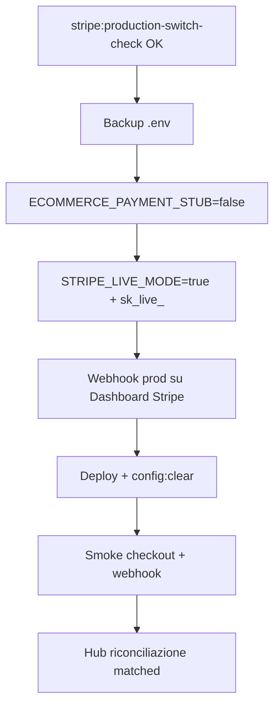

# Stripe reconciliation produzione — Runbook

**Sprint 117 · Ciclo 10** · Switch Stripe sandbox → produzione e-commerce + riconciliazione pagamenti CRM vs webhook.

**Prerequisiti:** Sprint 103 (`StripeProductionPreflightService`, idempotency webhook) · Sprint 117 switch + reporting.

**Verifica:** `php artisan stripe:production-switch-check --dry-run` · hub `/segreteria/ecommerce` · export CSV riconciliazione.

---

## 1. Gate pre-switch produzione

| # | Gate | Verifica |
|---|------|----------|
| 1 | Stub pagamenti off | `ECOMMERCE_PAYMENT_STUB=false` |
| 2 | Live mode | `STRIPE_LIVE_MODE=true` |
| 3 | Chiave produzione | `STRIPE_KEY=sk_live_…` |
| 4 | Webhook checkout | `STRIPE_WEBHOOK_SECRET=whsec_…` |
| 5 | Endpoint registrato | `POST {APP_URL}/webhooks/stripe/ecommerce` su Stripe Dashboard |
| 6 | Valuta | `STRIPE_CURRENCY=eur` |
| 7 | Switch check | `php artisan stripe:production-switch-check` — SUCCESS |
| 8 | Dispute (opz.) | `STRIPE_DISPUTE_WEBHOOK_SECRET` quando `STRIPE_DISPUTE_STUB=false` |

---

## 2. Sequenza switch



### Env produzione

```env
ECOMMERCE_PAYMENT_STUB=false
STRIPE_LIVE_MODE=true
STRIPE_KEY=sk_live_...
STRIPE_WEBHOOK_SECRET=whsec_...
STRIPE_CURRENCY=eur
STRIPE_DISPUTE_STUB=true
STRIPE_RECONCILIATION_DAYS=30
```

### Webhook Stripe Dashboard

1. Developers → Webhooks → Add endpoint
2. URL: `https://{dominio}/webhooks/stripe/ecommerce`
3. Eventi minimi: `checkout.session.completed`
4. Dispute (fase 2): `charge.dispute.created`, `charge.dispute.updated`, `charge.dispute.closed`

---

## 3. Riconciliazione pagamenti

Il CRM confronta:

- **Ordini Stripe** (`ecommerce_ordini` con `payment_gateway=stripe`)
- **Eventi webhook** (`stripe_webhook_events`, tipo `checkout.session.completed`)

| Stato | Significato |
|-------|-------------|
| `matched` | Ordine CRM + webhook allineati (session id) |
| `crm_only` | Ordine confermato senza webhook (verificare Dashboard) |
| `stripe_only` | Webhook senza ordine CRM (session orfana) |
| `crm_pending` | Ordine in attesa pagamento |

**Hub:** `/segreteria/ecommerce` — KPI riconciliazione + export CSV.

**CLI report:** usare export CSV o `StripeReconciliationReportService::summary()`.

---

## 4. Dispute workflow (stub)

Con `STRIPE_DISPUTE_STUB=true` (default ciclo 10):

1. Webhook `charge.dispute.*` → log `stripe.dispute.stub` + record in `stripe_webhook_events`
2. Nessuna submit evidence automatica — gestione manuale su Stripe Dashboard
3. Hub e-commerce mostra workflow prep e conteggio dispute aperti

### Go-live dispute (futuro)

```env
STRIPE_DISPUTE_STUB=false
STRIPE_DISPUTE_WEBHOOK_SECRET=whsec_...
```

Abilitare eventi dispute sullo stesso endpoint o endpoint dedicato.

---

## 5. Fallback stub pagamenti

1. **`ECOMMERCE_PAYMENT_STUB=true`** — checkout token, nessuna API Stripe
2. **`STRIPE_LIVE_MODE=false`** + `sk_test_` — ripristino sandbox
3. **`php artisan config:clear`** — badge «Pagamenti stub»
4. **Disattivare webhook prod** su Stripe Dashboard

Vedi sezione «Rollback stub pagamenti» in hub e-commerce.

---

## 6. Monitoraggio post-switch

| Segnale | Azione |
|---------|--------|
| `crm_only` > 0 | Verificare webhook delivery su Stripe Dashboard |
| `stripe_only` > 0 | Session senza ordine — controllare metadata checkout |
| Webhook 400 | Verificare `STRIPE_WEBHOOK_SECRET` |
| Duplicate events | Idempotency OK — verificare log `duplicate: true` |

---

## Riferimenti

- [SPRINT-117-REVIEW-HANDOFF.md](SPRINT-117-REVIEW-HANDOFF.md)
- `tests/fixtures/stripe/webhook-reconciliation.json`
- Sprint 103 — idempotency, mail riconciliazione
