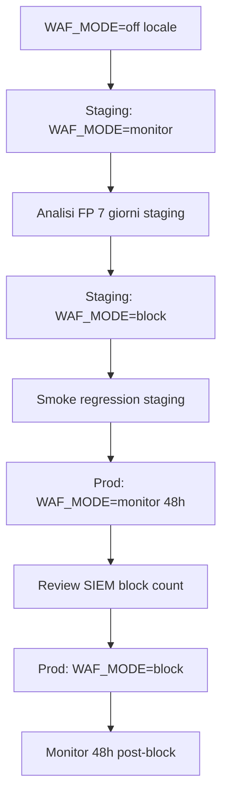

# WAF staging/prod rollout — Monitor 48h → Block

**Sprint 105 · Ciclo 9** · Runbook operativo per team infra + security.

**Prerequisiti:** [WAF-RULES-PREP.md](WAF-RULES-PREP.md) · [OWASP-INTERNAL-CHECKLIST.md](OWASP-INTERNAL-CHECKLIST.md) · `WafDeploymentPreflightService`.

**UI verifica:** `/admin/waf-status` (admin).

**Sprint 114:** tuning block post-deploy con cross-ref findings P0/P1 su path WAF — vedi tab «Path protetti × findings» in UI admin.

---

## 1. Sequenza rollout



| Fase | Ambiente | `WAF_MODE` | Durata min | Gate |
|------|----------|------------|------------|------|
| 0 | locale/dev | `off` | — | PHPUnit verde |
| 1 | staging | `monitor` | 7 giorni | SIEM riceve eventi |
| 2 | staging | `block` | 3 giorni | Zero FP critici su Livewire/login |
| 3 | produzione | `monitor` | **48h** (`WAF_MONITOR_HOURS_BEFORE_BLOCK`) | Spike review |
| 4 | produzione | `block` | continuo | Alert configurati |

---

## 2. Fase 1 — Monitor-only (staging)

### Env

```env
WAF_MODE=monitor
WAF_PROVIDER=aws
WAF_SIEM_LOG_GROUP=/aws/waf/rentri-crm-staging
WAF_MONITOR_HOURS_BEFORE_BLOCK=48
```

### Azioni infra

1. Associare Web ACL ad ALB/CloudFront staging.
2. Attivare **count-only** su tutte le managed rule groups OWASP.
3. Abilitare logging verso CloudWatch / S3 → SIEM.
4. Creare esclusioni iniziali:
   - Header `X-Livewire`
   - Header `Stripe-Signature`
   - Path `/webhooks/stripe/ecommerce` — managed rules → count only

### Verifica applicativa

```bash
php artisan test --filter=WafDeploymentPreflightTest
# Admin UI: /admin/waf-status → badge "Monitor-only", ready_monitor = sì
```

### Criteri uscita fase 1

- [ ] Log SIEM ricevuti per 7 giorni consecutivi
- [ ] Catalogo false positive documentato (minimo: Livewire, xFIR base64, note registro)
- [ ] Nessun block involontario (mode monitor = 0 deny)

---

## 3. Fase 2 — Block (staging)

### Env

```env
WAF_MODE=block
```

### Azioni infra

1. Passare managed rules da count → **block** per SQLi/XSS su query string.
2. Attivare block su `*.env`, `*.git`.
3. Rate-based rule su `/login` (10/min IP).
4. **Mantenere count-only** su `/webhooks/stripe/ecommerce` body rules.
5. IP allowlist opzionale su `/admin/*` in staging.

### Smoke post-block

| Test | Expected |
|------|----------|
| Login segreteria | 200 |
| Livewire update VFU wizard | 200 |
| Upload cert test.p12 | 200 |
| Stripe webhook test (Stripe CLI) | 200 |
| GET `/.env` | 403 WAF |
| `/admin/audit` da IP non allowlist (staging) | 403 |

---

## 4. Fase 3 — Produzione monitor 48h

### Env produzione (fase 3)

```env
WAF_MODE=monitor
WAF_SIEM_LOG_GROUP=/aws/waf/rentri-crm-prod
```

### Checklist go/no-go

- [ ] Staging block stabile ≥ 3 giorni
- [ ] `WafDeploymentPreflightService::isReadyForMonitorMode()` true
- [ ] Pen-test prep completata ([PEN-TEST-EXTERNAL-SCOPE.md](PEN-TEST-EXTERNAL-SCOPE.md))
- [ ] **Zero findings P0 aperti** su `/admin/pen-test-prep` (Sprint 114 gate)
- [ ] **Zero findings P0/P1 aperti** su path WAF mappati (UI cross-ref)
- [ ] Comunicazione ops: finestra monitor prod 48h
- [ ] Rollback runbook condiviso (§ 6)

### Tuning post-deploy block (Sprint 114)

1. Review tab **Path protetti × findings P0/P1** su `/admin/waf-status`.
2. Per ogni path con `needs_tune`: aggiornare regola WAF infra o chiudere finding su pen-test prep.
3. Eseguire smoke §3 post-block.
4. Monitor SIEM 48h — alert spike block rate.

### Metriche SIEM (48h)

| Metrica | Soglia review |
|---------|---------------|
| Count SQLi su `/livewire/update` | > 0 → analisi FP prima block |
| Count su `/webhooks/stripe/ecommerce` | Baseline Stripe IP |
| Count admin paths | Solo IP team atteso |
| Error rate app (5xx) | Invariato vs pre-WAF |

---

## 5. Fase 4 — Produzione block

### Env

```env
WAF_MODE=block
```

### Ordine attivazione rule groups (graduale)

1. **Giorno 0** — Block path traversal + sensitive files
2. **Giorno 1** — Block SQLi query string
3. **Giorno 2** — Block XSS query string
4. **Giorno 3** — Block XSS body Livewire (con esclusioni documentate)
5. **Giorno 4+** — Rate limits login + admin IP allowlist

**Non blockare** webhook Stripe body fino a validazione esplicita con eventi test.

---

## 6. Rollback

| Scenario | Azione | Tempo target |
|----------|--------|--------------|
| FP massivo Livewire | Rule group → count-only | < 15 min |
| Webhook Stripe 403 | Esclusione path + header | < 15 min |
| Login bloccato | Disabilitare rate rule login | < 5 min |
| Emergenza totale | `WAF_MODE=off` + detach Web ACL | < 30 min |

### Comandi / ticket infra (AWS esempio)

```bash
# Count-only emergenza su Web ACL
aws wafv2 update-web-acl --scope REGIONAL --default-action Allow=...
# Oppure: set env WAF_MODE=monitor e redeploy (badge UI aggiornato)
```

**Post-rollback:** post-mortem entro 24h; aggiornare esclusioni in WAF-RULES-PREP.md.

---

## 7. SIEM integration

### Log fields minimi

| Campo | Uso |
|-------|-----|
| `timestamp` | Timeline |
| `action` | ALLOW / COUNT / BLOCK |
| `terminatingRuleId` | Quale regola |
| `httpRequest.uri` | Path |
| `httpRequest.clientIp` | Source IP |
| `httpRequest.headers` | Verifica esclusioni |

### Retention

- **90 giorni** minimum (compliance audit).
- Export settimanale su cold storage opzionale.

### Alert consigliati

| Alert | Condizione | Severità |
|-------|------------|----------|
| WAF block spike | > 100 block/h su `/livewire/update` | P1 |
| Admin path block | Any block su `/admin/*` da IP interni | P1 |
| Stripe webhook block | Any block su webhook path | P0 |
| Login block rate | > 50 block/h su `/login` | P2 |

### Correlazione app

- Load balancer → header `X-Request-Id` → log Laravel `storage/logs`.
- Dashboard: confronto WAF block count vs HTTP 403 applicativi.

---

## 8. Sign-off

| Fase | Ruolo | Data | OK |
|------|-------|------|-----|
| Staging monitor | DevOps | | ☐ |
| Staging block | Security | | ☐ |
| Prod monitor 48h | Ops | | ☐ |
| Prod block | Tech lead + Security | | ☐ |

---

## Riferimenti

- [WAF-RULES-PREP.md](WAF-RULES-PREP.md)
- [GO-LIVE-OPERATIVO.md](GO-LIVE-OPERATIVO.md)
- [REMEDIATION-FINDINGS-TEMPLATE.md](REMEDIATION-FINDINGS-TEMPLATE.md)
- [SPRINT-105-AUDIT-NOTES.md](SPRINT-105-AUDIT-NOTES.md)

---

*Runbook Sprint 105 — agg. Sprint 114 block tuning + findings cross-ref.*
